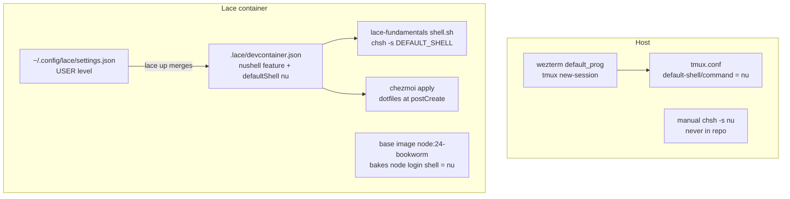

# Nushell Unwind: Restore bash + ble.sh Across Dotfiles, Lace, and Downstream Repos

> BLUF: Unwind the nushell trial and restore bash + ble.sh as the default shell everywhere, end to end.
> The complete pre-nu setup is preserved under `archive/legacy/`, so restoration is recovery plus a few ports, not a rewrite.
> Scope spans the dotfiles repo, the `lace` devcontainer framework, and four lace-consuming repos, but the entanglement is thin: one tmux line on the host and a handful of devcontainer shell-config declarations.
> Strategy: de-default only (leave nu installed and its two host scripts intact), port the nu-era gains worth keeping (the `LACE_PROJECT_NAME` starship module, the `wt-clone` command), and provide ble.sh inside containers via a new lace feature enabled at the user-settings level.
> Four phases: host restore, lace feature + de-default, downstream hand-edits, cleanup. The lace flip cascades to two of the four downstream repos for free.

## Summary

Nushell was trialed as the default interactive shell across the host and every lace devcontainer.
This proposal reverses that decision and returns to bash + ble.sh while keeping the improvements the nu era produced.

The reversal is small because nu was wired in through a few well-understood seams, not woven through application code.
No downstream repo contains nu scripts, nu in `package.json`, or nu application logic: the entanglement is purely at the devcontainer shell-configuration layer, with one inert exception (whelm vendors a copy of the sprack nu hook, addressed in Phase 3).
On the host, nu is the default through essentially one line in `tmux.conf` plus a manual `chsh` never captured in the repo.

Three user decisions shape the design and are treated as settled: restore with gains ported forward, provide container ble.sh via a user-level lace feature, and de-default nu without uninstalling it.
A fourth decision authorizes flipping live machine state (`chsh` on the host, editing `~/.config/lace/settings.json`).

> NOTE: This document lives in the dotfiles repo, but the work spans `lace` and four downstream repos.
> Phase ordering is deliberate so the lace change cascades outward before the downstream repos are touched individually.

## Objective

Restore bash + ble.sh as the default interactive shell on the host and inside every lace devcontainer, while preserving the nu-era gains that matter and leaving nu installed for the two host scripts that still use it.

## Background

### The nu trial and what it displaced

The complete pre-nu bash + ble.sh setup is preserved under `archive/legacy/` (git-tracked but `.chezmoiignore`d):

- `archive/legacy/bash/{bashrc,blerc,aesthetics.sh,completions.sh,prompt_and_history.sh,utils.sh,starship.toml}`
- `archive/legacy/chezmoi_run_once/run_once_before_20-install-blesh.sh`
- `archive/legacy/tmux.conf`

Commit `742fd97` (2026-02-05, "clauding hard or hardly clauding") deleted `dot_bashrc` and `dot_blerc`.
Commit `a61ba74` moved the `bash/*` sources into `archive/legacy/`.
Restoration draws from `742fd97^` and the archived copies.

### How nu becomes the default, by layer

Nu is the default through a small number of seams. Understanding each is the whole of the migration.



Host seams:

- `dot_config/tmux/tmux.conf:9-11` hardcodes `set -g default-shell ~/.cargo/bin/nu` and `set -g default-command ~/.cargo/bin/nu`. The archived `tmux.conf` used `set -g default-shell $SHELL`.
- wezterm (`dot_config/wezterm/wezterm.lua`) launches tmux via `config.default_prog = {'tmux','new-session','-A','-s','main'}`. It does not name nu, so it needs no change.
- No `chsh`/passwd/run-script in the repo sets nu as the login shell. That was done manually on the machine.

Lace seams (none live in lace's committed `.devcontainer/devcontainer.json`):

1. User-level `~/.config/lace/settings.json` (outside any repo) adds the [eitsupi nushell devcontainer feature](https://github.com/eitsupi/devcontainer-features) (`ghcr.io/eitsupi/devcontainer-features/nushell:0`) and sets `defaultShell: /usr/local/bin/nu`. `lace up` merges this into the generated `.lace/devcontainer.json` (`packages/lace/src/lib/up.ts:315-390,835-865`; `user-config-merge.ts:159-199`).
2. The `lace-fundamentals` feature `chsh`'s the user to whatever `defaultShell` it is handed (`devcontainers/features/src/lace-fundamentals/steps/shell.sh:3-19`).
3. Dotfiles apply via chezmoi at container start (`lace-fundamentals-init` at postCreateCommand), bind-mounted to `/mnt/lace/repos/dotfiles`.

The interactive shell reached via `bin/lace-into` is already `/bin/bash -l` (`build_exec_cmd`, `lace-into:443-457`): tmux panes attach as bash regardless of the login shell.
The nu default matters for new login shells and for any tooling that reads the user's shell, not for the pane you land in.

### Downstream consumers

Entanglement is purely at the devcontainer shell-config layer. No nu code, scripts, or `package.json` entries exist in any consumer, with one inert exception noted for whelm below.

- **jif** (`/var/home/mjr/code/weft/jif/main`), heavy: its own `.devcontainer/devcontainer.json` hand-authors the nushell feature (~line 73), `defaultShell: /usr/local/bin/nu` (~76), and `containerEnv.SHELL=/usr/local/bin/nu` (~112). Dockerfile comments reference `env.nu`. Base is the flutter image (does not bake nu).
- **weftwise** (`/var/home/mjr/code/weft/weftwise/main`), heavy: its own `.devcontainer/devcontainer.json` hand-authors a `nushell-config` mount to `/home/node/.config/nushell` (~120-124) and removed the bash-history mount (~160), calling nu "the primary shell". Base `FROM lace.local/node:24-bookworm`.
- **clauthier** (`/var/home/mjr/code/weft/clauthier/main`), light: nu inherited from lace injection only; its Dockerfile still bakes bash history. Near-free once lace flips.
- **whelm** (`/var/home/mjr/code/apps/whelm`), light: nu inherited only; a comment notes the base image `lace.local/node:24-bookworm` bakes the node user's login shell to nushell and that node bootstrap "chokes on `&&` under nushell", so it works around nu. Near-free once lace flips for the shell default. One inert exception: whelm vendors its own copy of the sprack feature at `.devcontainer/features/sprack/install.sh:57-70`, containing the same nu `sprack-hooks.nu` heredoc block. It is inert (the hook only fires if a nu config sources it, and nu is de-defaulted) and does not affect the shell default, but Phase 4's edit to lace's `sprack/install.sh` will not propagate to it, so Phase 3 drops it explicitly.

### Base-image nu bake (verified)

`lace-fundamentals/steps/shell.sh` runs `chsh -s "$DEFAULT_SHELL"` only inside `if [ -n "$DEFAULT_SHELL" ]`.
If `defaultShell` is simply removed from user settings, `DEFAULT_SHELL` is empty and the feature does not `chsh` at all.
The `node:24-bookworm` base image bakes the node user's login shell to nushell, so removing the value alone would leave nu as the baked login shell inside those containers.
The plan therefore sets `defaultShell` to bash explicitly rather than clearing it.

## Proposed Solution

Reverse each seam above and port forward the gains, in four phases.

1. **Dotfiles host restore.** Restore `dot_bashrc` and `dot_blerc` from the archive, restore the ble.sh installer, point tmux back at `$SHELL`, add bash-side starship/zoxide init to the restored bash config, port `wt-clone` to a bash function, `chsh -s /usr/bin/bash` on the host, and keep the current shell-agnostic `starship.toml`.
2. **Lace: ble.sh feature + de-default.** Author a `blesh` devcontainer feature (or fold a ble.sh install into `lace-fundamentals`), enable it at the user-settings level mirroring how the nushell feature was configured, remove the nushell feature and nu `defaultShell` from `~/.config/lace/settings.json`, and set `defaultShell` to bash explicitly.
3. **Downstream hand-edits.** Edit jif's and weftwise's own devcontainer files to drop their hand-authored nu config; verify clauthier and whelm inherit bash for free from the lace flip.
4. **Cleanup.** Regenerate the lace `devcontainer-lock.json`, update `lace-fundamentals` examples and README, fix TypeScript test fixtures, and drop the sprack nu hook.

### Gains ported forward

- **Keep** the current `dot_config/starship.toml` `[custom.container]` module, which shows the lace project name via `LACE_PROJECT_NAME` and already spawns `bash --noprofile --norc` internally. It is shell-agnostic and ports for free. Do not revert to `archive/legacy/bash/starship.toml`.
- **Port** `wt-clone` (`dot_config/nushell/scripts/wt-clone.nu`) to a bash function in the restored bash config. It creates the nikitabobko bare-worktree layout that lace's `classifyWorkspace()` recognizes; the logic is git plumbing plus relative-gitdir fixups, all portable to bash.
- **Do not re-implement** the vi keybindings: ble.sh provides them. `scripts/keybindings.nu` explicitly mirrors the archived `dot_blerc`, so ble.sh already covers it.
- **Do not port** `fix-atomic-home`: it was never needed under bash + ble.sh.

### Container ble.sh via a user-level feature

Mirror the mechanism that injected nu.
The nushell feature was declared once in `~/.config/lace/settings.json` and merged into every container by `lace up`.
Provide ble.sh the same way so every container gains it without per-repo edits.

Investigate whether an existing feature pattern can be mirrored directly; the likely outcome is a new `blesh` feature under `devcontainers/features/src/` that clones and builds ble.sh and ensures interactive bash sources it.
Folding the install into `lace-fundamentals` is an acceptable alternative if feature ordering or build cost argues for it.

## Important Design Decisions

Four decisions are settled and drive the design.

- **Restore fidelity: port gains forward.** Restore bash + ble.sh, and preserve the nu-era gains that matter (the `LACE_PROJECT_NAME` starship module, the `wt-clone` command). Rationale: the trial produced real improvements orthogonal to the shell choice; discarding them would be a regression, and both are cheap to carry.
- **Container parity via a user-level lace feature.** Provide ble.sh inside containers through a devcontainer feature enabled and configured in `~/.config/lace/settings.json`. Rationale: this mirrors exactly how nu reached every container, so parity is achieved with one declaration instead of per-repo edits, and it keeps container shell config out of individual repos.
- **De-default only.** Stop nu being any shell's default, but leave nu installed and leave the two nu host scripts (`bin/lace-inspect`, `bin/lace-paste-image`) as-is. Rationale: those are host tooling with no bash equivalent yet; rewriting them is unnecessary risk. Nu staying installed costs nothing once it is not a default.
- **Flip live machine state.** Run `chsh -s /usr/bin/bash` on the host and edit `~/.config/lace/settings.json` as part of implementation. Rationale: the repo cannot express the manual `chsh` or the out-of-repo user settings, so the migration is incomplete unless implementation touches live state directly.

## Edge Cases / Challenging Scenarios

- **Base-image nu bake (must handle).** As verified above, removing `defaultShell` leaves the `node:24-bookworm` baked login shell (nu) in place because `lace-fundamentals` skips `chsh` when `DEFAULT_SHELL` is empty. Set `defaultShell` to bash explicitly (for example `/bin/bash` or `/usr/bin/bash`, whichever the feature and image agree on) so `chsh` runs and overrides the bake. Verify inside a fresh container that `getent passwd node` reports bash.
- **ble.sh build cost in containers.** Building ble.sh from source on every container create adds startup latency. Mitigate by pinning a release, caching the build in the feature layer, or baking it into base images if latency proves painful. Flag as a tuning follow-up, not a blocker.
- **Nu installed but non-default.** `run_once_before_30-install-carapace.sh` installs carapace "for nushell completions". Keep it: carapace is harmless under bash and still serves the retained nu host scripts. Leave the nu install path intact; only the defaults change.
- **Sprack nu hook removal.** The `sprack` feature (`devcontainers/features/src/sprack/install.sh`) emits both a bash hook (`/etc/profile.d/sprack-metadata.sh`, lines 48-55) and a nu hook (`/etc/nushell/sprack-hooks.nu`, lines 57-70). Bash parity already exists, so drop the nu heredoc block as pure entanglement. Low risk.
- **Stray nu references with no runtime effect.** `lace-fundamentals/devcontainer-feature.json:12` and `README.md:32` use `/usr/bin/nu` as the `defaultShell` example; `devcontainer-feature.json:19` is a distinct `installsAfter` entry (`ghcr.io/eitsupi/devcontainer-features/nushell`), a dependency-ordering reference rather than a defaultShell example; `neovim/install.sh:52` has a "su - may start nushell" workaround comment; TypeScript test fixtures under `packages/lace/src/**/__tests__/` hardcode nu. Update these in cleanup so the codebase reflects the bash default; none affect runtime.
- **wezterm untouched.** wezterm.lua does not name nu and needs no change. If it is touched for any reason, the repo `CLAUDE.md` WezTerm validation workflow (parse-check via `ls-fonts` stderr, `show-keys` diff) applies. It should not be touched.

## Test Plan

Each phase has a concrete acceptance check; the verification methodology below gives the exact commands.

- **Host:** login shell is bash, tmux panes are bash, ble.sh loads, starship prompt renders, `wt-clone` works as a bash function.
- **Lace container:** `node` login shell is bash, an interactive container bash session has ble.sh active, the `LACE_PROJECT_NAME` starship module still renders, no nushell feature present in the generated `.lace/devcontainer.json`.
- **Downstream:** jif and weftwise containers come up with bash after their hand-edits; clauthier and whelm come up with bash with no shell-config change beyond the lace flip (whelm additionally drops its inert vendored sprack nu heredoc).
- **Cleanup:** lace test suite passes with bash-default fixtures; `devcontainer-lock.json` no longer pins the nushell feature.

## Verification Methodology

Run these directly after each phase; do not rely on inspection alone.

Host (Phase 1), non-interactive checks (run from any shell, including `bash -c`):

```sh
getent passwd "$USER" | awk -F: '{print $7}'   # expect /usr/bin/bash
echo "$SHELL"                                  # expect /usr/bin/bash after chsh
tmux new-session -d -s vt 'echo $0; sleep 1'   # pane shell should be bash
tmux capture-pane -pt vt
ls ~/.local/share/blesh/ble.sh                 # ble.sh installed on disk
type wt-clone                                  # expect a bash function
```

Host (Phase 1), interactive checks (run BY HAND in a live interactive bash: `$BLE_VERSION` is only populated inside an interactive ble.sh session, so it cannot be checked from a non-interactive `bash -c`):

```sh
echo "ble loaded: ${BLE_VERSION:-no}"          # expect a version string, not "no"
# confirm vi keybindings respond and the starship prompt renders
```

Lace container (Phase 2), after `lace up` and entering a container:

```sh
getent passwd node | awk -F: '{print $7}'      # expect bash, NOT nu (base-image bake check)
bash -lic 'echo "ble: ${BLE_VERSION:-no}"'     # expect a version string
grep -c nushell .lace/devcontainer.json        # expect 0
```

The starship prompt in the container should still show the lace project name via `LACE_PROJECT_NAME`; confirm this visually in an interactive container shell.

Downstream (Phase 3): rebuild each container and repeat the `getent passwd node` and ble checks.
Confirm clauthier and whelm need no shell-config change for the bash default (whelm's sprack nu-heredoc removal is a separate inert cleanup, not a shell-default change).

Cleanup (Phase 4): run the lace TypeScript test suite and confirm the regenerated lock file omits the nushell feature.

## Implementation Phases

Phases are ordered so the lace change (Phase 2) cascades to clauthier and whelm before Phase 3 touches jif and weftwise.
Do not reorder Phase 2 after Phase 3.

### Phase 1: Dotfiles host restore

Scope: dotfiles repo only.

- Restore `dot_bashrc` and `dot_blerc` from `742fd97^` or adapt `archive/legacy/bash/{bashrc,blerc}` plus the sourced fragments (`aesthetics.sh`, `completions.sh`, `prompt_and_history.sh`, `utils.sh`).
- Restore the ble.sh installer from `archive/legacy/chezmoi_run_once/run_once_before_20-install-blesh.sh`.
- Edit `dot_config/tmux/tmux.conf:9-11` back to `set -g default-shell $SHELL` (and drop the nu `default-command`), matching `archive/legacy/tmux.conf`.
- Add bash-side shell init to the restored bash config: `starship init bash` and `zoxide init bash`, sourced from the restored `dot_bashrc` (or its fragments). Leave the nu init generation in place: `dot_config/nushell/env.nu:78` (`starship init nu | save -f $cache`) and `env.nu:92` (`zoxide init nushell | save -f $cache`), sourced via `config.nu:44,47`, stay as-is. The nu tree is retained for the two host scripts and is simply no longer launched by default, so this phase adds bash init rather than replacing the nu generation. (`env.nu:51` is `$env.STARSHIP_SHELL = "nu"`, a nu-only variable, not the init generation.)
- Port `wt-clone` (`dot_config/nushell/scripts/wt-clone.nu`) to a bash function in the restored config; preserve the reserved-name guard, relative-gitdir fixups, and the `.worktree-root` marker.
- Keep the current `dot_config/starship.toml` unchanged.
- Apply and validate before flipping the login shell: run `chezmoi apply --force`, then follow the chsh safety checklist below. Only after bash + ble.sh is validated in a fresh terminal, run `chsh -s /usr/bin/bash`.

Host chsh safety checklist (never close your only working shell):

1. Run `chezmoi apply --force` from the current (still-working) terminal, and keep that terminal open throughout.
2. Open a NEW terminal or shell and confirm bash + ble.sh loads there: prompt renders, ble.sh is active, keybindings work (see the interactive checks in the verification block). Do not proceed until this passes.
3. Ensure `/usr/bin/bash` is listed in `/etc/shells` (`grep -qxF /usr/bin/bash /etc/shells`); `chsh` refuses shells not listed. Add it if missing. Pin the absolute path `/usr/bin/bash` deliberately, since PATH `bash` may resolve to the linuxbrew copy.
4. Only then run `chsh -s /usr/bin/bash`.
5. Revert path if anything is wrong: `chsh -s ~/.cargo/bin/nu` (or re-point to the prior shell) and restore the `settings.json` backup. Nu stays installed and remains a valid login shell, so this is a clean rollback.

Constraints: do not touch wezterm.lua. Do not delete the nu config tree or the two nu host scripts. Do not restore `archive/legacy/bash/starship.toml`.

Acceptance: host verification block passes.

### Phase 2: Lace ble.sh feature and de-default

Scope: lace repo plus the out-of-repo `~/.config/lace/settings.json`.

- Author a `blesh` feature under `devcontainers/features/src/` (or fold a ble.sh install into `lace-fundamentals`). Investigate mirroring the eitsupi-nushell-via-user-settings pattern first.
- Edit `~/.config/lace/settings.json`: remove the `ghcr.io/eitsupi/devcontainer-features/nushell` feature, remove `defaultShell: /usr/local/bin/nu`, add the ble.sh feature, and set `defaultShell` to bash explicitly (do not merely clear it: see the base-image edge case).
- `lace up` a representative container and run the lace container verification block.

Constraints: do not edit downstream repos yet. Prove the flip in one container before cascading.

Acceptance: container verification block passes, including `getent passwd node` reporting bash and ble.sh active.

Dependency: Phase 2 must precede Phase 3 so clauthier and whelm inherit bash for free.

### Phase 3: Downstream hand-edits

Scope: jif and weftwise (shell-config edits); whelm (verify shell default, plus an inert sprack nu-heredoc cleanup); clauthier (verify-only).

- **jif:** remove the hand-authored nushell feature (~line 73), `defaultShell: /usr/local/bin/nu` (~76), and `containerEnv.SHELL=/usr/local/bin/nu` (~112) from its `.devcontainer/devcontainer.json`; scrub the `env.nu` Dockerfile comments. jif's flutter base does not bake nu, so no `chsh` override concern beyond setting bash.
- **weftwise:** remove the `nushell-config` mount (~120-124) and restore the bash-history mount (~160) in its `.devcontainer/devcontainer.json`.
- **clauthier:** rebuild and verify it comes up with bash with no per-repo change beyond the Phase 2 lace flip.
- **whelm:** rebuild and verify it comes up with bash with no shell-config edit beyond the Phase 2 lace flip. Separately, drop the inert nu heredoc block from its vendored sprack copy (`.devcontainer/features/sprack/install.sh:57-70`, the `# Nushell integration` comment through `NU_EOF`), leaving the bash profile.d hook intact. This mirrors Phase 4's edit to lace's `sprack/install.sh`, which does not propagate to whelm's vendored copy.

Acceptance: all four containers report bash; clauthier and whelm required no shell-config edits (whelm's sprack nu-heredoc removal is a separate inert cleanup, not a shell-default change).

### Phase 4: Cleanup

Scope: lace repo.

- Regenerate `.devcontainer/devcontainer-lock.json` to drop the pinned nushell feature (`:23-27`).
- Update the `defaultShell` example to bash in `lace-fundamentals/devcontainer-feature.json:12` and `README.md:32`. Separately, remove (or adjust) the `installsAfter` nushell entry at `devcontainer-feature.json:19` (`ghcr.io/eitsupi/devcontainer-features/nushell`), which no longer applies once the nushell feature is gone.
- Update the `neovim/install.sh:52` "su - may start nushell" comment.
- Update TypeScript test fixtures under `packages/lace/src/**/__tests__/` to reflect the bash default.
- Drop the nu heredoc block from `sprack/install.sh` (lines 57-70), leaving the bash hook intact.

Acceptance: lace test suite passes; regenerated lock omits the nushell feature; no stray `/usr/bin/nu` defaults remain in lace docs or examples.

## Follow-ups (Out of Scope)

- Integrate [stinkpot](https://tangled.org/oppi.li/stinkpot) via a separate `/rfp`. Its single-sql-file nature is awkward for the many-container setup; deferred.
- Rewrite the two nu host scripts (`bin/lace-inspect`, `bin/lace-paste-image`) to bash. They remain nu for now.
- Fix container image-paste into claude-in-container (flaky independent of this migration).
- Tune ble.sh container build cost (pin/cache/bake) if startup latency becomes painful.
