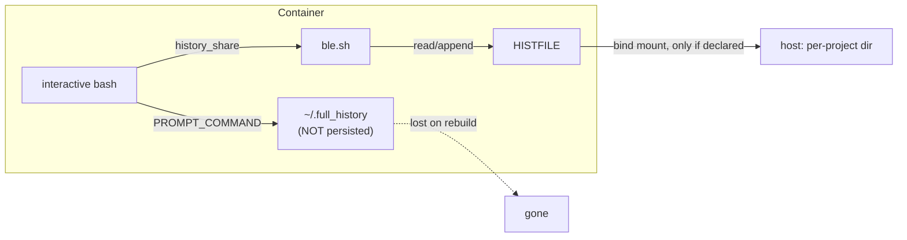
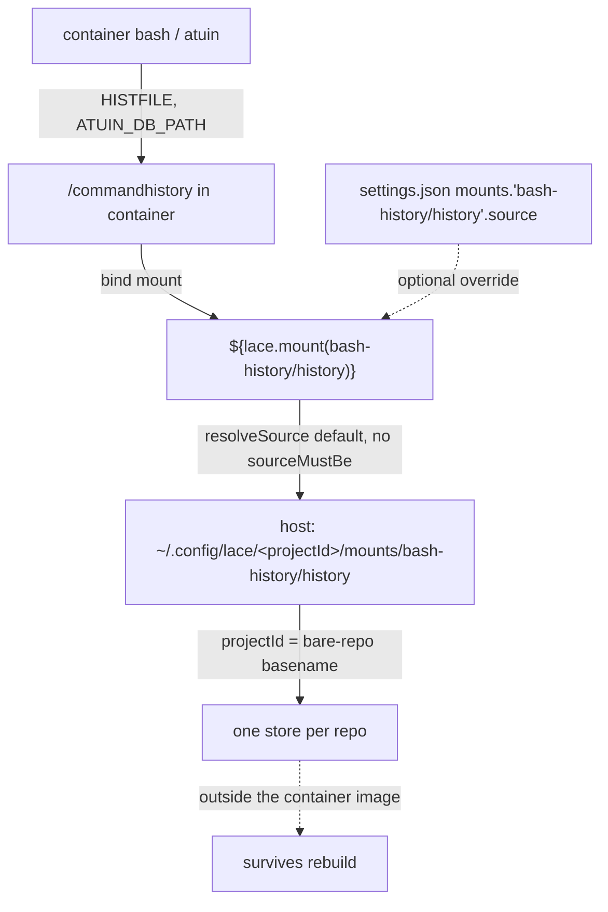

# Persistent, Per-Project Bash History for Lace Devcontainers

> BLUF: The recommended solution is well-tuned plain-text history and nothing heavier: declare the existing `/commandhistory` bind mount from a new user-level lace `bash-history` feature, tune the dotfiles (`HISTCONTROL`, `HISTTIMEFORMAT`, an explicit `history -a` flush), and keep ble.sh's `history_share` + isearch.
> That layer alone fully satisfies "persistent but not shared across projects" with minimal hassle: one `user.json` line gives every container its own per-project store at `~/.config/lace/<projectId>/mounts/bash-history/history`, exactly the way `blesh` is enabled today, and it is a strict improvement over hand-editing each repo's devcontainer.json.
> Rich metadata (exit code, duration, cwd, host, session) is an **optional opt-in tier**, not the default: the feature ships the mount + tuning by default and gates any rich-tool install OFF behind a `historyTool` option the user can decline.
> If richness is wanted, atuin (local-only/offline, db pointed into the same mount) is the better-supported choice because it documents `ATUIN_DB_PATH`/`ATUIN_CONFIG_DIR` while stinkpot does not, but atuin is heavier (a binary, a Ctrl-R conflict, SQLite-on-mount, another moving part) and is presented against the user's stated "a bit heavy" skepticism; stinkpot stays in the head-to-head as the minimalist alternative, and mcfly is do-not-adopt.
> Whether to opt into any rich tool at all is a human decision point; the default recommendation is to stop at the plain-text floor.

## Summary

The bash + ble.sh restoration ([nushell-unwind](2026-08-25-nushell-unwind.md), implemented) already ships the persistence primitive this proposal builds on: a `/commandhistory` bind mount plus ble.sh's `history_share=1`.
That primitive is wired inconsistently across repos and captures only plain text.
This proposal does two things: it makes per-project persistence uniform and automatic (the recommended default, complete on its own), and it offers an optional rich-history layer the user can decline, without re-proposing any finished work.

The recommended default is deliberately modest: the mount-wiring fix plus dotfiles tuning plus ble.sh's existing history features is a complete, low-maintenance answer to the stated requirement.
Rich tools (atuin, stinkpot) are optional upgrade tiers layered on top, gated OFF in the feature by default; the user opts in only if the added metadata and search are worth the added moving parts.

The uniformity fix is the load-bearing decision.
Rather than adding a `customizations.lace.mounts.bash-history` stanza to each repo's devcontainer.json (the framing in the [anchor report](../reports/2026-09-01-persistent-history-for-lace-devcontainers.md)), a single new lace feature *declares* that mount, so lace auto-injects it into every container the feature is enabled in.
Enabling it is one line in `~/.config/lace/user.json`, next to the `blesh` line that already reaches every container.
This mirrors how the nushell-history prior art ([2026-03-25-lace-nushell-history-persistence.md](/home/mjr/code/weft/lace/main/cdocs/proposals/2026-03-25-lace-nushell-history-persistence.md)) packaged persistence as a dedicated feature, but inverts its default: per-project isolation is the default here (the task's not-shared requirement), with shared history as the opt-in override.

> NOTE(opus/lace-bash-history): This document lives in the dotfiles repo, but the work spans `lace`, four downstream consumers, and out-of-repo user config, exactly like nushell-unwind.
> Phase ordering is deliberate so the lace feature cascades outward before downstream repos are individually touched.

## Objective

Give each lace devcontainer a persistent bash history that survives container rebuilds and is isolated per project (never shared across projects or with the host), then optionally enrich it with per-entry metadata (exit code, duration, cwd, host, session) and a better interactive search.
Achieve this within lace's existing mount and feature infrastructure, enabled once at the user level rather than per repo, with no change required to shared dotfiles for the baseline case.

## Background

### The primitive already exists, used inconsistently

Lace resolves a `customizations.lace.mounts.<label>` declaration into a bind mount whose default host source is `~/.config/lace/<projectId>/mounts/<namespace>/<labelPart>`, auto-created (`packages/lace/src/lib/mount-resolver.ts` `resolveSource()`).
`projectId` is the bare-repo-root basename (`packages/lace/src/lib/repo-clones.ts` `deriveProjectId` → `project-name.ts` `deriveProjectName`), so it is per-repo, shared across all worktrees of that repo.
This is precisely the isolation the task asks for: one history store per repo, on the host, distinct from every other project and from the host, durable because it lives outside the container image.

The wiring today is inconsistent (verified; see the [anchor report](../reports/2026-09-01-persistent-history-for-lace-devcontainers.md) and the [phase-3 review](../reviews/2026-08-25-review-of-nushell-unwind-phase3-r1.md)):

- The `lace` repo's own `.devcontainer/devcontainer.json` declares `customizations.lace.mounts.bash-history: { target: "/commandhistory" }`. It is the only repo using the mechanism correctly.
- `clauthier` prepares `/commandhistory` in its Dockerfile and sets `HISTFILE`/`PROMPT_COMMAND='history -a'` there (`.devcontainer/Dockerfile:6,40-42,60`) but declares **no host mount**, so its history is plain container-image state and does **not** survive a rebuild.
- `weftwise` bypasses the mechanism: its `mounts[]` hardcodes `source=${localEnv:HOME}/code/dev_records/weft/bash/history,target=/commandhistory,type=bind`, a single fixed global path with no project keying, and (per the phase-3 review) nothing even points `HISTFILE` at it. Its mount comment claiming "the restored dotfiles bashrc points HISTFILE here" is false.
- `jif` and `whelm` declare no bash-history mount.

The dotfiles bash config already sets `HISTFILE=/commandhistory/.bash_history` whenever `/commandhistory` exists (`dot_config/bash/prompt_and_history.sh:10-12`), guarded on the directory so host shells are unaffected.
So clauthier's Dockerfile `HISTFILE` line is now redundant with the dotfiles, and any container that both declares the mount and applies the dotfiles gets persistence with no per-repo `HISTFILE` wiring at all.

### What runs inside a container today

- Plain-bash `HISTFILE` at `/commandhistory/.bash_history` when the mount exists (`prompt_and_history.sh:10-12`), `HISTSIZE`/`HISTFILESIZE=1000000`, `HISTIGNORE` filtering trivial commands, `histappend` set (`dot_bashrc:59`).
- `HISTCONTROL` is **commented out** (`prompt_and_history.sh:1`), so duplicates are not deduped; `HISTTIMEFORMAT` is unset, so the file carries no timestamps; there is **no explicit `history -a`** flush in the dotfiles `PROMPT_COMMAND`.
- ble.sh `history_share=1` (`dot_blerc:1`) shares history live across panes within a container.
- A hand-rolled `~/.full_history` logger (`prompt_and_history.sh:100-106`) appends `date hostname PWD $(history 1)` on every prompt, but writes **outside** the mount, so it is lost on every rebuild.



### Prior art and references

- Tool selection and ranking are driven by the [persistent-history anchor report](../reports/2026-09-01-persistent-history-for-lace-devcontainers.md) (2026-09-01).
- This sits downstream of the completed [nushell-unwind proposal](2026-08-25-nushell-unwind.md) and its [devlog](../devlogs/2026-08-25-nushell-unwind.md); the "stinkpot integration" follow-up named there is what this proposal resolves.
- The reusable architecture (dedicated feature declaring a mount, `settings.json` source override, config/state separation) comes from lace's [2026-03-25 nushell-history-persistence proposal](/home/mjr/code/weft/lace/main/cdocs/proposals/2026-03-25-lace-nushell-history-persistence.md). Port its architecture, not its nushell specifics; invert its shared-by-default to per-project-by-default.
- External tools: [atuin](https://docs.atuin.sh/), [stinkpot](https://tangled.org/oppi.li/stinkpot), [ble.sh](https://github.com/akinomyoga/ble.sh).

## Proposed Solution

The recommended solution is Layers 1 and 2 plus ble.sh's existing history features: this is a complete, self-standing answer to "persistent but not shared," and is what the `bash-history` feature ships by default.
Layer 3 (a rich tool) is an optional opt-in tier, gated OFF by default; it is presented, with honest hassle accounting, for the user who wants richer metadata and search.

### Layer 1: fix the mount-wiring gap via a user-level `bash-history` feature (recommended)

Author a new lace devcontainer feature `bash-history` whose `devcontainer-feature.json` declares:

```jsonc
"customizations": { "lace": { "mounts": {
  "history": { "target": "/commandhistory", "description": "Persistent per-project bash + atuin history" }
} } }
```

Because lace auto-injects a `${lace.mount(<namespace>/<label>)}` entry for every feature-declared mount not already referenced (`packages/lace/src/lib/template-resolver.ts` `autoInjectMountTemplates`, with the feature short-id namespacing in `buildMountDeclarationsMap`), enabling this feature causes lace to inject `${lace.mount(bash-history/history)}` into every container's `mounts[]`.
That resolves per-project to `~/.config/lace/<projectId>/mounts/bash-history/history` on the host (`mount-resolver.ts` `resolveSource` default, reached because the declaration carries no `sourceMustBe`), and is overridable via a `settings.json` `mounts."bash-history/history".source` entry.

Enable it once, at the user level, alongside `blesh`:

```jsonc
// ~/.config/lace/user.json
"features": {
  "ghcr.io/weftwiseink/devcontainer-features/blesh:1": {},
  "ghcr.io/weftwiseink/devcontainer-features/bash-history:1": {}
}
```

> NOTE(opus/lace-bash-history): This is strictly better than the anchor report's per-repo-stanza framing.
> A per-repo `customizations.lace.mounts.bash-history` stanza must be added to, and kept in sync across, every repo's devcontainer.json; a repo that forgets it silently loses history (exactly clauthier's and jif/whelm's current state).
> A user-level feature declaration is a single source of truth: opt in once, and every container this user builds gets the mount, the same way `blesh` reaches every container.
> Per-repo declaration remains available for a repo that wants history when this user's feature is not enabled, but it is the exception, not the norm.

This layer alone delivers "persistent and not shared across projects" for plain `HISTFILE`, since the dotfiles already point `HISTFILE` into `/commandhistory`.
Downstream cleanup rides on it: migrate weftwise off its hardcoded global path onto the feature-injected mount, drop clauthier's now-redundant Dockerfile `HISTFILE` hack, and let jif/whelm opt in for free by virtue of the user-level enablement.

### Layer 2: plain-bash tuning + ble.sh history features (recommended)

Tune the dotfiles so the floor is high even if ble.sh ever fails to load (`prompt_and_history.sh`):

- Set `HISTCONTROL=ignoreboth:erasedups` (currently commented out): drop leading-space and consecutive/repeated duplicates.
- Set `HISTTIMEFORMAT='%F %T '`: bash then writes `#<epoch>` timestamp comments into `HISTFILE` on every `history -a`/exit, giving timestamps with no external tool.
- Add an explicit `history -a` to `PROMPT_COMMAND`: the only thing between "recorded" and "lost" if ble.sh's `history_share` is inactive, since a container stop/kill does not guarantee a clean bash exit that flushes history.
- Keep `bleopt history_share=1`.

Keep ble.sh's existing history UX as part of this floor: `bleopt history_share=1` for live cross-pane sharing (already on) and its `isearch/backward` on C-r (`dot_blerc:34`). No new tooling; these are already installed by the `blesh` feature.

`~/.full_history` disposition: do not maintain two overlapping rich-history mechanisms.
Redirect the logger into the mount (`/commandhistory/.full_history` when `/commandhistory` exists, else the current `~/.full_history`) so it stops being lost on rebuild.
If, and only if, the user later opts into a rich tool (Layer 3), retire it, since atuin captures the same host/cwd fields plus exit code and duration; otherwise it stays as the poor-man's rich log on the persistent mount.

> NOTE(opus/lace-bash-history): Layers 1 and 2 together are the recommended, complete solution.
> They deliver per-project persistent history that survives rebuilds, deduped and timestamped, shared live across panes but never across projects or with the host, with zero new binaries and no Ctrl-R conflict.
> Everything below is optional.

### Layer 3 (optional): rich metadata via a swappable tool

This tier is opt-in and OFF by default.
It buys per-entry exit code, duration, cwd, host, session, and a filtered search UI, at the cost of a new binary per container, a Ctrl-R rebinding, a SQLite db on the bind mount, and one more moving part to maintain.
The user has called atuin "a bit heavy," so the bar for opting in is real richness that the plain-text floor cannot provide (structured, exit-code-aware, per-directory search), weighed honestly against that overhead.

If opting in, the recommended tool is atuin in fully offline/local-only mode (no login, no sync server), gated behind the feature's `historyTool` option, with its store pointed into the per-project mount:

- `ATUIN_DB_PATH=/commandhistory/atuin/history.db`
- `ATUIN_CONFIG_DIR=/commandhistory/atuin` (config.toml + the offline key/session live here, so the key is stable across rebuilds)

atuin records command text, timestamp, exit code, duration, hostname, session id, and cwd automatically, with dir/host/session/global search filters.
Pointing `ATUIN_DB_PATH` into `/commandhistory` inherits the same per-repo isolation the plain-`HISTFILE` mechanism already has, with zero new lace plumbing.

> NOTE(opus/lace-bash-history): The 2026-03-25 nushell-history Model A analysis argues config and state should be separated (config baked/deployed, state in the mount).
> Applied strictly, only `ATUIN_DB_PATH` would go in the mount while `ATUIN_CONFIG_DIR` stays baked in the image.
> Co-locating both in the mount is chosen instead because atuin's offline encryption key and session token live under `ATUIN_CONFIG_DIR`; keeping them in the mount keeps them stable across rebuilds and keeps all per-project state in one place. The `config.toml` is static (offline settings), so there is no config-evolution cost to storing it there. This is a reversible decision.

Ctrl-R ownership (must be resolved explicitly): ble.sh binds `C-r` to `isearch/backward` in `vi_nmap` (`dot_blerc:34`), and atuin's shell init also binds `C-r`.
atuin natively supports ble.sh, so `eval "$(atuin init bash)"` is designed to wire atuin's search through ble.sh's keymap, but the explicit `ble-bind -m vi_nmap -f C-r isearch/backward` in `dot_blerc` can shadow it.
Intended resolution: atuin owns `C-r` when present, achieved by guarding the `dot_blerc` `C-r isearch/backward` binding on `! command -v atuin` (or dropping it so atuin's ble.sh integration owns the key), and running `atuin init bash` from the feature's profile.d snippet.

Load-order caveat: whether the profile.d `atuin init` runs before or after ble.sh finishes attaching its vi keymap is not guaranteed by construction (profile.d files source in filename order, and ble.sh's keymap hooks fire via `blehook/eval-after-load`, so the final C-r owner depends on interleaving that this proposal does not prove statically).
The actual mitigation is the interactive test, not the reasoning: in a real tmux pane or container login shell (a one-shot `bash -c` does NOT load ble.sh, so it cannot verify this, per the nushell-unwind method), press C-r after atuin init and confirm atuin's UI opens rather than ble.sh isearch.
If the guard alone does not win the binding, force it by re-binding C-r to atuin's widget from a `blehook/eval-after-load keymap_vi` hook, which runs after ble.sh's own vi bindings.

## Per-Project Isolation Mechanism

Isolation is entirely inherited from lace's mount resolver; no custom keying is written.
The chain, per container:



`projectId` is the bare-repo-root basename (`repo-clones.ts` `deriveProjectId` → `project-name.ts` `deriveProjectName`), so every worktree of a repo (e.g. `lace/main`, `lace/feature-x`) shares one store.

> NOTE(opus/lace-bash-history): Per-repo, not per-worktree, is a deliberate design choice to confirm, not a bug.
> Cross-worktree command recall within a project is usually desirable, and it matches the 2026-03-25 prior art's keying.
> Per-worktree isolation would require a lace change (a per-worktree `projectId` or mount-label suffix) and is out of scope.
> WARN(opus/lace-bash-history): The corollary is that two worktrees of the same repo running simultaneously share one atuin sqlite db. See the SQLite concurrency risk below.

## Lace-Side Features / Improvements

### The `bash-history` feature (`devcontainers/features/src/bash-history/`)

One feature, with the rich tool gated by an option that is **OFF by default**.
Rationale for one feature, not two: the mount is useless without something pointing at it, and the rich tool is useless without the mount; coupling them keeps enablement to a single `user.json` line and a single on/off.
The default `historyTool: "none"` delivers the recommended solution (mount + dotfiles-tuned plain `HISTFILE` + ble.sh), so the common case installs no rich tool at all; opting into atuin or stinkpot is a config flip on the same feature, not a second feature.

`devcontainer-feature.json` shape (mirroring `blesh`'s version/option conventions):

```jsonc
{
  "id": "bash-history",
  "version": "1.0.0",
  "name": "Persistent Bash History",
  "description": "Declares the per-project /commandhistory bind mount for persistent, per-project bash history. Optionally installs a rich history tool (atuin or stinkpot, local-only) pointed at the same mount, OFF by default.",
  "options": {
    "historyTool": {
      "type": "string",
      "enum": ["none", "atuin", "stinkpot"],
      "default": "none",
      "description": "Optional rich history tool to install and wire for interactive bash. Default 'none' leaves the recommended plain-HISTFILE persistence only; 'atuin' or 'stinkpot' is an opt-in richness tier."
    },
    "atuinVersion": { "type": "string", "default": "18.6.1",
      "description": "Pinned atuin release tag (without leading 'v') for the prebuilt binary. This is the latest-at-authoring pin; bump it like the blesh feature's version option." },
    "stinkpotVersion": { "type": "string", "default": "",
      "description": "Pinned stinkpot release/commit when historyTool=stinkpot." }
  },
  "containerEnv": {
    "HISTFILE": "/commandhistory/.bash_history",
    "ATUIN_DB_PATH": "/commandhistory/atuin/history.db",
    "ATUIN_CONFIG_DIR": "/commandhistory/atuin"
  },
  "customizations": { "lace": { "mounts": {
    "history": { "target": "/commandhistory",
      "description": "Persistent per-project bash + atuin history" }
  } } },
  "installsAfter": [
    "ghcr.io/devcontainers/features/common-utils",
    "ghcr.io/weftwiseink/devcontainer-features/blesh",
    "ghcr.io/weftwiseink/devcontainer-features/lace-fundamentals"
  ]
}
```

> NOTE(opus/lace-bash-history): `containerEnv.HISTFILE` is redundant with the dotfiles guard (`prompt_and_history.sh:10-12` sets the same value when `/commandhistory` exists) but is set anyway so the feature is self-sufficient in a container that does not apply these dotfiles. The two never disagree.

`install.sh` sketch, mirroring `blesh` exactly (pinned prebuilt release, source fallback, `_REMOTE_USER`/`USER_HOME`, idempotency guard, chown):

```sh
#!/bin/sh
set -eu
HISTORY_TOOL="${HISTORYTOOL:-none}"
ATUIN_VERSION="${ATUINVERSION:-18.6.1}"
_REMOTE_USER="${_REMOTE_USER:-root}"
# ... USER_HOME resolution identical to blesh ...

[ "$HISTORY_TOOL" = "none" ] && { echo "bash-history: mount-only, no rich tool."; exit 0; }

if [ "$HISTORY_TOOL" = "atuin" ]; then
  # atuin ships prebuilt release tarballs; the node base image has NO cargo,
  # so a prebuilt binary is mandatory (cargo install is not an option).
  install_atuin_from_release  # curl the atuin-<arch>-unknown-linux-* tarball -> /usr/local/bin/atuin, idempotent
  # profile.d init (sprack pattern): runs at login-shell startup, inherently
  # AFTER postCreate, so it needs no postCreate ordering guarantee.
  cat > /etc/profile.d/atuin.sh <<'PROFILE_EOF'
if [ -n "${BASH_VERSION:-}" ] && command -v atuin >/dev/null 2>&1; then
  mkdir -p "${ATUIN_CONFIG_DIR:-$HOME/.config/atuin}"
  # seed an offline/local-only config.toml once (no sync, no login)
  [ -f "${ATUIN_CONFIG_DIR}/config.toml" ] || cat > "${ATUIN_CONFIG_DIR}/config.toml" <<'CFG'
auto_sync = false
update_check = false
CFG
  # atuin natively integrates with ble.sh; this binds atuin search to C-r
  eval "$(atuin init bash)"
fi
PROFILE_EOF
fi
# chown the mount-adjacent dirs and any installed binary to the remote user
```

Why profile.d, not postCreate: there is no general mechanism guaranteeing a feature's `postCreateCommand` runs after `lace-fundamentals-init` (injected into `postCreateCommand` at `up.ts:868-896`, running `chezmoi apply` via lace-fundamentals' `steps/git-identity.sh:37`), and object-form `postCreateCommand` entries run in parallel per the devcontainer spec regardless of key order.
Anything that must be present at interactive-shell time (the atuin init, the C-r binding) must therefore be a `/etc/profile.d/*.sh` snippet, which runs at every login-shell startup, inherently later than postCreate and needing no ordering.
`installsAfter` orders only the build step, so it is used to build after `blesh`, `lace-fundamentals`, and `common-utils`, but it does not (and need not) order the interactive init.

### Wiring

- `~/.config/lace/user.json`: add `"ghcr.io/weftwiseink/devcontainer-features/bash-history:1": {}` to `features`, next to `blesh:1`. Nothing else required for the per-project default.
- `~/.config/lace/settings.json`: **no override needed** for the default per-project path. Document the shared-history override as the explicit opt-in alternative (the inverse of the 2026-03-25 prior art, where shared was the default):

```jsonc
// settings.json - OPT-IN shared-across-projects history only
"mounts": { "bash-history/history": { "source": "~/.config/lace/shared/bash-history" } }
```

The override source must exist on disk (`mount-resolver.ts` requires it), unlike the auto-created default.

### installsAfter ordering vs blesh

`bash-history` builds after `blesh` so that, if a future revision wants to touch ble.sh's fzf/atuin key wiring at build time, ble.sh is already installed.
For the interactive C-r resolution it does not matter (profile.d ordering is by filename at login, and both `blesh`-sourced ble.sh and `atuin.sh` run then); `installsAfter` is retained purely for build determinism, consistent with how `blesh installsAfter common-utils` and `neovim installsAfter rust` are used.

## Important Design Decisions

- **Well-tuned plain text is the recommended default.** Mount-wiring fix + tuned `HISTFILE` + ble.sh is a complete answer to "persistent but not shared," with no new binaries, no Ctrl-R conflict, and nothing extra to maintain. A rich tool is an optional tier, not part of the recommendation.
- **User-level feature over per-repo stanzas.** One source of truth, opt-in once, cannot be forgotten per repo. Justified above.
- **Per-project (per-repo) isolation is the default; shared is opt-in.** This satisfies the task's not-shared requirement and inverts the 2026-03-25 prior art's shared default. Per-repo (not per-worktree) is a confirm-not-bug choice.
- **Rich tool OFF by default, swappable via `historyTool`.** `historyTool: none` is the default; if the user opts in, atuin is the better-supported choice (see the head-to-head), but atuin is explicitly weighed against the user's "a bit heavy" view rather than assumed.
- **One feature, tool gated by an option.** Mount and tool are useless apart; coupling keeps a single enable line and lets the default `historyTool: none` ship mount + tuning with no rich-tool code path exercised.
- **profile.d, not postCreate, for interactive init.** Forced by the lace postCreate ordering caveat.
- **Prebuilt atuin binary, never `cargo install`.** The `node` base image has no cargo in the base layer (cargo appears only if the neovim feature pulls it in; confirmed by the nushell-unwind follow-up that `cargo install starship` silently skips in containers). Mirror `blesh`'s pinned-release install.

### atuin vs stinkpot (head-to-head)

Both are optional richness tiers layered on top of the plain-text default; this comparison decides which to reach for *if* the user opts into a rich tool, not whether to.
The user named "stinkpot or similar" as a preference, so this is weighed explicitly rather than defaulted silently.

| Dimension | atuin | stinkpot |
|---|---|---|
| Store-path redirection into the mount | Documented `ATUIN_DB_PATH` + `ATUIN_CONFIG_DIR` | No documented db-path override; default `~/.local/share/stinkpot`, redirection unverified |
| Metadata captured | text, timestamp, exit code, duration, host, session, cwd | text, timestamp, frequency; exit-code capture unclear per its README |
| Search filters | dir / host / session / global | search + frequency, no per-directory/project filters |
| Offline / local-only | First-class (skip login, no server) | Local-only by design (no sync exists) |
| ble.sh integration | Native, documented | Unverified; likely needs the same C-r coexistence handling |
| Devcontainer precedent | Widespread; mirrors the `blesh` pinned-release pattern cleanly | None in this repo's tooling; no prior feature to copy |
| Footprint / supply chain | Larger Rust codebase, larger ecosystem | ~400 lines Go, no sync/AI/KV/dotfiles-manager: minimal |
| Maintenance signal | Active, popular | New, small, single-author; long-term unclear |

**If a rich tool is chosen, atuin is the better-supported one.**
The rich-tier design hinges on pointing the store at the per-project mount, and atuin is the only one of the two that documents the env-var override that makes this work; with stinkpot the redirection is unverified and would be the riskiest, least-documented part of the design.
atuin also captures the exact metadata the objective names (exit code, duration, host, cwd, session) and provides the per-directory/host filters that make per-project history worth having.
stinkpot's appeal is genuine but is footprint and supply-chain minimalism, not capability; if that is valued over atuin's maturity and documented isolation, it is a one-line `historyTool: "stinkpot"` swap, at the cost of verifying its store-path redirection and exit-code capture first.

> NOTE(opus/lace-bash-history): DECISION POINT for the human supervisor.
> The primary decision is whether to opt into any rich tool at all; the recommendation is to stop at the plain-text floor, since the user considers atuin heavy and Layers 1-2 already satisfy the requirement.
> If richness is wanted, the secondary decision (atuin vs. stinkpot) is a values call: atuin wins on the load-bearing axis (documented mount redirection, richer filters, maturity), stinkpot wins on minimal footprint, which is what the user leaned toward.
> Because the feature ships both as `historyTool` options with a `none` default, both decisions are config flips, not rewrites; Phase 4 is entirely optional and should not proceed without the supervisor explicitly choosing to opt in.

- **mcfly: do not adopt.** Its [Gentoo package](https://packages.gentoo.org/packages/app-shells/mcfly) is flagged as needing a new maintainer, a real long-term risk for a daily-driver tool, and it offers nothing atuin does not do better here.

## Edge Cases / Challenging Scenarios

- **SQLite on a bind mount, concurrent access.** atuin's history.db uses SQLite WAL, which relies on `fcntl` locking. This is safe on a local Linux filesystem across a shared kernel, and unsafe on NFS. Because `projectId` is per-repo, two worktrees of the same repo running containers simultaneously share one atuin db and can contend on writes; on a local fs this is at worst brief millisecond lock waits, not corruption. WARN: if `~/.config/lace` ever lives on NFS, this is unsafe and the design must revisit. This is the same concurrency point the 2026-03-25 report raised for shared nushell history; here it applies only within a single repo's worktrees, not across projects.
- **ble.sh vs atuin C-r.** Resolved above: atuin owns C-r when present; guard or drop the `dot_blerc` `C-r isearch/backward` binding, and init atuin from profile.d so its ble.sh-aware binding is installed at shell start. Verify by pressing C-r in a live container pane (not `bash -c`, which does not load ble.sh).
- **Migrating existing history.** Existing per-repo `/commandhistory/.bash_history` carries over automatically once the mount is declared. `~/.full_history` (host and container) is unstructured and is retired, not migrated. weftwise's hardcoded global file (`~/code/dev_records/weft/bash/history/.bash_history`) is a single shared blob; do not auto-merge it into per-project stores (it would pollute every project). Leave it in place for reference and let the new per-project store accumulate fresh, matching the 2026-03-25 "no migration" stance.
- **atuin import from bash HISTFILE.** On first atuin start, run `atuin import auto` (once, idempotently from profile.d guarded on an import marker) to seed atuin from the existing `/commandhistory/.bash_history`, so the rich store is not empty on adoption.
- **weftwise hardcoded-path cleanup.** Remove the hardcoded `mounts[]` entry so the feature-injected `${lace.mount(bash-history/history)}` takes over; this moves weftwise from an accidental global file to real per-project isolation, and fixes the false mount comment the phase-3 review flagged.
- **clauthier Dockerfile redundancy.** Drop the `COMMAND_HISTORY_PATH`/`HISTFILE` export from clauthier's Dockerfile (`:6,40-42,60`); the dotfiles set `HISTFILE` and the feature declares the mount, so the Dockerfile hack is dead weight and its `/commandhistory` was never actually persisted (no mount).
- **Container build/startup cost.** The atuin binary install adds latency. Mitigate exactly as `blesh` does: pinned prebuilt release tarball, cached in the image layer since user features merge into `prebuildFeatures`. No source build unless the release download fails.
- **chezmoi never manages the db.** The atuin db and bash history live under `/commandhistory` (a bind mount), entirely outside chezmoi's `$HOME`-managed source, so chezmoi cannot touch them; no `.chezmoiignore` entry is needed. WARN: do not place any atuin path under a chezmoi-managed `~/.config/atuin`; if that is ever done, add an unanchored `atuin/history.db*` pattern (never a leading slash, per the chezmoi 2.72 gotcha below).
- **chezmoi 2.72 leading-slash gotcha.** The container chezmoi (2.72+) rejects leading-slash `.chezmoiignore` patterns with "invalid path", aborting `chezmoi apply` (the regression caught at the end of nushell-unwind). Any `.chezmoiignore` edit this work requires (expected: none) must keep patterns unanchored.

## Test Plan

- **Layer 2 (dotfiles):** `HISTCONTROL`, `HISTTIMEFORMAT`, and the explicit `history -a` flush are set; `~/.full_history` writes into `/commandhistory` when mounted; ble.sh still loads and `history_share` still works.
- **Layer 1 (feature + mount):** a freshly built container has `/commandhistory` bind-mounted to `~/.config/lace/<projectId>/mounts/bash-history/history`; commands typed there survive a rebuild; a second, different project gets a distinct store.
- **Downstream:** weftwise builds with the injected mount and no hardcoded path; clauthier builds with the Dockerfile hack removed and still persists; jif/whelm gain persistence with no per-repo edit.
- **Layer 3 (atuin):** atuin records exit code/duration/cwd/host; `atuin search` returns per-directory results; C-r opens atuin (not ble's isearch) in a live pane; the db lands under `/commandhistory/atuin/` and survives a rebuild; two projects have isolated atuin histories.

## Verification Methodology

Run these directly after each phase; do not rely on inspection.
Interactive ble.sh/atuin checks must run in a real tmux pane or container login shell: a one-shot `bash -c` does **not** load ble.sh (confirmed in nushell-unwind), so `${BLE_VERSION}` is empty there.

Dotfiles (Phase 1), from an interactive bash:

```sh
echo "$HISTCONTROL"                 # expect ignoreboth:erasedups
echo "$HISTTIMEFORMAT"              # expect '%F %T '
echo "$PROMPT_COMMAND" | grep -q 'history -a' && echo "flush wired"
echo "ble: ${BLE_VERSION:-no}"      # expect a version, not "no"
```

Feature + mount (Phase 2), after `lace up` and entering a container:

```sh
getent passwd node | awk -F: '{print $7}'          # expect bash
mount | grep /commandhistory                       # expect the bind mount present
echo "$HISTFILE"                                    # expect /commandhistory/.bash_history
echo unique-marker-$$ >> "$HISTFILE"               # write a marker
# rebuild the container, re-enter, then:
grep unique-marker "$HISTFILE"                      # marker survived the rebuild
```

On the host, confirm the per-project store exists and two projects differ.
`<projectId>` is the bare-repo-root basename; derive it explicitly rather than guessing:

```sh
# projectId = basename of the bare repo root for this worktree
bare="$(git rev-parse --path-format=absolute --git-common-dir)"   # .../<repo>/.bare or .../<repo>/.git
projectId="$(basename "$(dirname "$bare")")"
ls "$HOME/.config/lace/$projectId/mounts/bash-history/history"     # this project's host store

ls -d "$HOME"/.config/lace/*/mounts/bash-history/history           # one dir per projectId, distinct
```

atuin (Phase 4), in a live container pane:

```sh
command -v atuin && atuin --version
false; true                                         # generate a known exit sequence
atuin search --limit 3                              # entries show exit code + duration
ls /commandhistory/atuin/history.db                 # db in the mount
# press C-r: atuin's UI opens, not ble.sh isearch
# rebuild, re-enter, atuin search still shows prior commands
```

## Implementation Phases

Phases 1-3 are the recommended solution and stand on their own; P4 is an optional opt-in tier that should not proceed unless the supervisor chooses richness.
Phases are ordered so the lace feature (P2) cascades to jif/whelm/clauthier before P3 touches downstream repos individually, mirroring nushell-unwind.

### Phase 1: Dotfiles bash tuning + `~/.full_history` disposition

Scope: dotfiles repo only (`dot_config/bash/prompt_and_history.sh`).

- Set `HISTCONTROL=ignoreboth:erasedups`, `HISTTIMEFORMAT='%F %T '`, add `history -a` to `PROMPT_COMMAND` (keep the existing `_prompt_func` structure).
- Redirect the `~/.full_history` logger to `/commandhistory/.full_history` when `/commandhistory` exists, else keep `~/.full_history`.
- Keep `bleopt history_share=1`.

Acceptance: the Phase 1 verification block passes in a live interactive bash; `chezmoi apply --force` succeeds (no leading-slash `.chezmoiignore` regression).

Constraints: do not touch ble.sh's fzf wiring; do not add leading-slash `.chezmoiignore` patterns.

### Phase 2: `bash-history` feature declaring the mount (no rich tool yet)

Scope: lace repo (`devcontainers/features/src/bash-history/`) plus out-of-repo `~/.config/lace/user.json`.

- Author the feature with `historyTool` default `none`, the `customizations.lace.mounts.history` declaration (target `/commandhistory`), `containerEnv.HISTFILE`, and `installsAfter` blesh + lace-fundamentals + common-utils. Mirror `blesh`'s three-file layout and README. This publish is the permanent default; the rich-tool code path (P4) is additive.
- Publish to ghcr (feature refs must resolve, per the nushell-unwind publish-before-use lesson), then add the feature to `user.json` next to `blesh:1`.
- Build one representative container, write a marker to `HISTFILE`, rebuild, confirm the marker survives and the host store is at `~/.config/lace/<projectId>/mounts/bash-history/history`.

Acceptance: Phase 2 verification block passes, including cross-project store distinctness.

Dependency: precedes P3 so downstream repos inherit the mount for free.

### Phase 3: Downstream cleanup

Scope: weftwise, clauthier (edits); jif, whelm (verify opt-in).

- **weftwise:** remove the hardcoded `mounts[]` `/commandhistory` entry and its false comment; rely on the feature-injected mount. Verify per-project isolation.
- **clauthier:** drop the `COMMAND_HISTORY_PATH`/`HISTFILE` export from the Dockerfile (`:6,40-42,60`). Verify history now actually persists via the feature-injected mount.
- **jif / whelm:** decide opt-in; with the user-level feature enabled they gain per-project persistence with no per-repo edit. Confirm by rebuild + marker survival. If a repo should not persist history, it can omit the feature via repo-level config, but the default is to inherit it.

Acceptance: all four repos report a bind-mounted `/commandhistory` resolving to a per-project host store; marker survives a rebuild in each.

### Phase 4 (optional, opt-in): atuin layer

Do not start this phase unless the supervisor explicitly opts into a rich tool over the plain-text default.

Scope: lace `bash-history` feature (rich-tool path) plus `user.json` / dotfiles C-r guard.

- Add the atuin prebuilt-release install and the `/etc/profile.d/atuin.sh` init (offline config seed, `atuin init bash`, one-time `atuin import auto`) to the feature; bump its version; publish.
- Confirm the atuin-vs-stinkpot default with the supervisor (see the decision-point NOTE), then set `historyTool: atuin` (the default) in the `user.json` feature entry.
- Guard the `dot_blerc` `C-r isearch/backward` binding on `! command -v atuin` (dotfiles change) so atuin owns C-r in containers while the host (no atuin) keeps ble isearch.
- Retire the `~/.full_history` logger now that atuin captures host/cwd/exit/duration.

Acceptance: Phase 4 verification block passes: rich capture, C-r coexistence, per-project atuin isolation, db survives a rebuild.

Constraints: prebuilt binary only (no cargo); do not place any atuin path under chezmoi management.

## Open Questions

- **Does the profile.d hook reliably reach interactive container shells?** (Only relevant if the rich tier is opted into.) The assumption rests on two precedents: sprack already ships its bash prompt hook via `/etc/profile.d/sprack-metadata.sh` and it fires in lace containers, and `bin/lace-into` attaches panes as `/bin/bash -l` (login shells, which source `/etc/profile.d/*`). This is judged reliable but is not proven statically here; the P4 interactive-pane test is the confirmation. Marked as a decision point, not a new commitment: if the hook does not reach a given container's interactive shells, the fallback is to source the atuin init from the dotfiles bash config instead of profile.d.

## Follow-ups (Out of Scope)

- **Per-worktree (not per-repo) isolation** would be a lace change (per-worktree `projectId` or a mount-label suffix); flagged, not done.
- **Host-side atuin adoption** so the host and containers share the rich search UX; the host currently has ble isearch on C-r and no atuin. A separate decision.
- **Retire `~/.full_history` on the host** once atuin lands there too; in containers it is retired in P4.
- **stinkpot enablement** remains a one-line `historyTool` swap if the supervisor prefers minimal footprint; verifying its store-path redirection and exit-code capture is the prerequisite.
