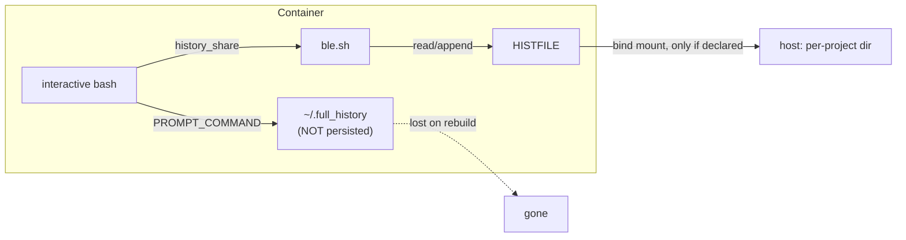
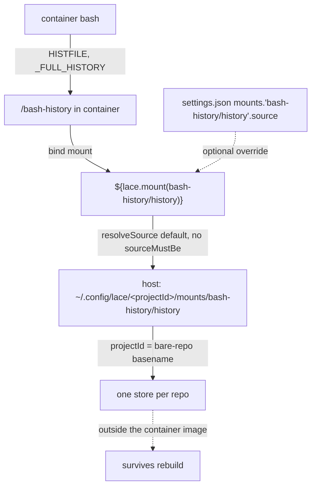

# Persistent, Per-Project Bash History for Lace Devcontainers

> BLUF: The solution is well-tuned plain-text history and nothing heavier.
> A new user-level lace `bash-history` feature declares the per-project bind mount at `/bash-history`, and the dotfiles point `HISTFILE` there, set the history effectively unlimited (`HISTSIZE=-1`, `HISTFILESIZE=-1`), stamp every entry with a second-accurate time (`HISTTIMEFORMAT='%F %T '`), add an explicit `history -a` flush, and route the append-only `~/.full_history` archive onto the same mount (`/bash-history/full_history`).
> One `user.json` line gives every container its own per-project store at `~/.config/lace/<projectId>/mounts/bash-history/history`, exactly the way `blesh` is enabled today, and it is a strict improvement over hand-editing each repo's devcontainer.json.
> History is endless and timestamped: the primary file is never truncated, and the archive appends every command regardless of history depth, so nothing is ever lost even if the live file were trimmed. This closes the history question with zero new binaries and no Ctrl-R conflict.
> Rich metadata tools (atuin, stinkpot) are considered and declined; see the alternatives NOTE. They can be revisited later but are out of scope now.

## Summary

The bash + ble.sh restoration ([nushell-unwind](2026-08-25-nushell-unwind.md), implemented) already ships the persistence primitive this proposal builds on: a per-project bind mount plus ble.sh's `history_share=1`.
That primitive is wired inconsistently across repos, points at an inconsistently-named container path, and its plain-text tuning is unfinished.
This proposal makes per-project persistence uniform and automatic, tunes the plain-text history for effectively unlimited, timestamped retention, and durably routes the append-only archive onto the mount, without re-proposing any finished work.

The design is deliberately modest and complete on its own: the mount-wiring fix plus dotfiles tuning plus ble.sh's existing history features is a full, low-maintenance answer to the stated requirement.
Plain text is the sole recommended and implemented design; no rich-tool tier ships.

The uniformity fix is the load-bearing decision.
Rather than adding a `customizations.lace.mounts.bash-history` stanza to each repo's devcontainer.json (the framing in the [anchor report](../reports/2026-09-01-persistent-history-for-lace-devcontainers.md)), a single new lace feature *declares* that mount, so lace auto-injects it into every container the feature is enabled in.
Enabling it is one line in `~/.config/lace/user.json`, next to the `blesh` line that already reaches every container.
This mirrors how the nushell-history prior art ([2026-03-25-lace-nushell-history-persistence.md](/home/mjr/code/weft/lace/main/cdocs/proposals/2026-03-25-lace-nushell-history-persistence.md)) packaged persistence as a dedicated feature, but inverts its default: per-project isolation is the default here (the task's not-shared requirement), with shared history as the opt-in override.

The in-container mount target is `/bash-history`, aligning the container path with the host store's existing `bash-history` naming.
The prior `/commandhistory` target is renamed everywhere, and the cross-repo consumers still on the old name are repointed with a one-time, idempotent, data-preserving migration (see Phase 3).

> NOTE(opus/lace-bash-history): This document lives in the dotfiles repo, but the work spans `lace`, three downstream consumers, and out-of-repo user config, exactly like nushell-unwind.
> Phase ordering is deliberate so the lace feature cascades outward before downstream repos are individually touched.

> NOTE(opus/lace-bash-history): Alternatives considered and declined - atuin and stinkpot.
> A rich-metadata tier (per-entry exit code, duration, cwd, host, session, and a filtered search UI) was evaluated and is explicitly out of scope.
> [stinkpot](https://tangled.org/oppi.li/stinkpot) documents no store-path redirection and no exit-code capture, so per-project isolation cannot be verified, and its single-SQL-file model is awkward across many containers.
> [atuin](https://docs.atuin.sh/) is capable and would work (offline mode, `ATUIN_DB_PATH`/`ATUIN_CONFIG_DIR` pointed into the mount), but it is a bit heavy: an extra per-container binary, a Ctrl-R rebinding that collides with ble.sh's isearch, and a SQLite db on a bind mount.
> Its metadata is not worth that maintenance for this user, and dropping it removes the profile.d/Ctrl-R load-order risk entirely.
> [mcfly](https://packages.gentoo.org/packages/app-shells/mcfly) is likewise declined: its Gentoo package is flagged as needing a new maintainer, and it offers nothing over the above.
> Any of these can be revisited later as a follow-up, but the plain-text floor is the whole design now.

## Objective

Give each lace devcontainer a persistent bash history that survives container rebuilds, is isolated per project (never shared across projects or with the host), is effectively unlimited (never truncated), and is timestamped to at least minute accuracy.
Achieve this within lace's existing mount and feature infrastructure, enabled once at the user level rather than per repo.

## Background

### The primitive already exists, used inconsistently

Lace resolves a `customizations.lace.mounts.<label>` declaration into a bind mount whose default host source is `~/.config/lace/<projectId>/mounts/<namespace>/<labelPart>`, auto-created (`packages/lace/src/lib/mount-resolver.ts` `resolveSource()`).
`projectId` is the bare-repo-root basename (`packages/lace/src/lib/repo-clones.ts` `deriveProjectId` → `project-name.ts` `deriveProjectName`), so it is per-repo, shared across all worktrees of that repo.
This is precisely the isolation the task asks for: one history store per repo, on the host, distinct from every other project and from the host, durable because it lives outside the container image.

The wiring today is inconsistent (verified; see the [anchor report](../reports/2026-09-01-persistent-history-for-lace-devcontainers.md) and the [phase-3 review](../reviews/2026-08-25-review-of-nushell-unwind-phase3-r1.md)), and every consumer still names the in-container path `/commandhistory`:

- The `lace` repo's own `.devcontainer/devcontainer.json` declares `customizations.lace.mounts.bash-history: { target: "/commandhistory" }`. It is the only repo using the mechanism correctly, but on the old target name.
- `clauthier` prepares `/commandhistory` in its Dockerfile and sets `HISTFILE`/`PROMPT_COMMAND='history -a'` there (`.devcontainer/Dockerfile:6,40-42,60`) but declares **no host mount**, so its history is plain container-image state and does **not** survive a rebuild.
- `weftwise` bypasses the mechanism: its `mounts[]` hardcodes `source=${localEnv:HOME}/code/dev_records/weft/bash/history,target=/commandhistory,type=bind`, a single fixed global path with no project keying. Nothing in weftwise's container points `HISTFILE` at it, because weftwise does not apply these dotfiles (no lace-fundamentals/chezmoi in that path), so its mount comment claiming "the restored dotfiles bashrc points HISTFILE here" is false in weftwise specifically.
- `jif` and `whelm` declare no bash-history mount.

The dotfiles bash config already sets `HISTFILE=/commandhistory/.bash_history` whenever `/commandhistory` exists (`dot_config/bash/prompt_and_history.sh:10-12`), guarded on the directory so host shells are unaffected.
Renaming that guard to `/bash-history` and pointing the feature's mount at the same target keeps this "no per-repo `HISTFILE` wiring" property while aligning the container path with the host store's `bash-history` naming.

### What runs inside a container today

- Plain-bash `HISTFILE` at `/commandhistory/.bash_history` when the mount exists (`prompt_and_history.sh:10-12`), `HISTSIZE`/`HISTFILESIZE=1000000`, `HISTIGNORE` filtering trivial commands, `histappend` set (`dot_bashrc:59`).
- `HISTCONTROL` is **commented out** (`prompt_and_history.sh:1`); `HISTTIMEFORMAT` is unset, so the file carries no timestamps; there is **no explicit `history -a`** flush in the dotfiles `PROMPT_COMMAND`.
- ble.sh `history_share=1` (`dot_blerc:1`) shares history live across panes within a container.
- A hand-rolled `~/.full_history` logger (`prompt_and_history.sh:100-106`) appends `date +%Y-%m-%d--%H-%M-%S`, hostname, PWD, and `history 1` on every prompt, but writes **outside** the mount, so it is lost on every rebuild.



### Prior art and references

- Tool selection and ranking are driven by the [persistent-history anchor report](../reports/2026-09-01-persistent-history-for-lace-devcontainers.md) (2026-09-01); its rich-tool recommendation is declined here (see the alternatives NOTE above).
- This sits downstream of the completed [nushell-unwind proposal](2026-08-25-nushell-unwind.md) and its [devlog](../devlogs/2026-08-25-nushell-unwind.md); the "stinkpot integration" follow-up named there is resolved by this proposal declining it.
- The reusable architecture (dedicated feature declaring a mount, `settings.json` source override, config/state separation) comes from lace's [2026-03-25 nushell-history-persistence proposal](/home/mjr/code/weft/lace/main/cdocs/proposals/2026-03-25-lace-nushell-history-persistence.md). Port its architecture, not its nushell specifics; invert its shared-by-default to per-project-by-default.
- External tools: [ble.sh](https://github.com/akinomyoga/ble.sh).

## Proposed Solution

Two parts, both plain text, both recommended and implemented: a user-level `bash-history` feature that declares the mount, and dotfiles tuning that makes the history endless, timestamped, and durably archived.

### Part 1: fix the mount-wiring gap via a user-level `bash-history` feature

Author a new lace devcontainer feature `bash-history` whose `devcontainer-feature.json` declares:

```jsonc
"customizations": { "lace": { "mounts": {
  "history": { "target": "/bash-history", "description": "Persistent per-project bash history" }
} } }
```

Because lace auto-injects a `${lace.mount(<namespace>/<label>)}` entry for every feature-declared mount not already referenced (`packages/lace/src/lib/template-resolver.ts` `autoInjectMountTemplates`, with the feature short-id namespacing in `buildMountDeclarationsMap`), enabling this feature causes lace to inject `${lace.mount(bash-history/history)}` into every container's `mounts[]`.
That resolves per-project to `~/.config/lace/<projectId>/mounts/bash-history/history` on the host (`mount-resolver.ts` `resolveSource` default, reached because the declaration carries no `sourceMustBe`), and is overridable via a `settings.json` `mounts."bash-history/history".source` entry.

Enable it once, at the user level, alongside `blesh`:

```jsonc
// ~/.config/lace/user.json
"features": {
  "ghcr.io/weftwiseink/devcontainer-features/blesh:1": {},
  "ghcr.io/weftwiseink/devcontainer-features/bash-history:1": {}
}
```

> NOTE(opus/lace-bash-history): This is strictly better than the anchor report's per-repo-stanza framing.
> A per-repo `customizations.lace.mounts.bash-history` stanza must be added to, and kept in sync across, every repo's devcontainer.json; a repo that forgets it silently loses history (exactly clauthier's and jif/whelm's current state).
> A user-level feature declaration is a single source of truth: opt in once, and every container this user builds gets the mount, the same way `blesh` reaches every container.
> Per-repo declaration remains available for a repo that wants history when this user's feature is not enabled, but it is the exception, not the norm.

The container target is `/bash-history`, matching the host store label so the two read the same.
The host source path (`~/.config/lace/<projectId>/mounts/bash-history/history`) is unchanged by the rename, so existing per-project stores carry over with no data move; only the in-container mount point changes name.

### Part 2: plain-bash tuning + ble.sh history features

Tune the dotfiles so the floor is high even if ble.sh ever fails to load (`prompt_and_history.sh`):

- `export HISTSIZE=-1` and `export HISTFILESIZE=-1`: bash treats a negative value as unlimited, so the in-memory list and the on-disk `HISTFILE` are never truncated. This is the endless-history requirement: nothing is ever aged out.
- `export HISTTIMEFORMAT='%F %T '`: bash then writes `#<epoch>` timestamp comments into `HISTFILE` on every `history -a`/exit and renders second-accurate times in `history` output, with no external tool. This exceeds the minute-accurate ask.
- `export HISTCONTROL=ignoreboth`: drop leading-space and immediate-duplicate entries. `erasedups` is intentionally not used: on an unbounded history it rescans the entire list on every command, and the archive already captures everything, so full-history dedup buys nothing here.
- Add an explicit `history -a` to `PROMPT_COMMAND` (as `PROMPT_COMMAND="history -a; _prompt_func"`, keeping the existing `_prompt_func`): the only thing between "recorded" and "lost" if ble.sh's `history_share` is inactive, since a container stop/kill does not guarantee a clean bash exit that flushes history.
- Keep `bleopt history_share=1` for live cross-pane sharing (already on) and ble.sh's `isearch/backward` on C-r (`dot_blerc:34`). No new tooling; these are already installed by the `blesh` feature. With no rich tool in play, the C-r binding stays exactly as it is, and there is no load-order risk.

#### The `~/.full_history` archive: belt-and-suspenders, routed onto the mount

The existing append-only logger (`prompt_and_history.sh:100-103`) is formalized as the durable backup log.
Every command is appended to it on every prompt, regardless of `HISTFILE` depth or dedup, with its own `%Y-%m-%d--%H-%M-%S` timestamp plus hostname and PWD.
So even in the impossible case that the primary file were ever trimmed, the full record survives in the archive.

Route the archive onto the per-project mount so it persists across rebuilds and stays per-project-isolated, exactly like `.bash_history`:

- In a container (mount present): the archive lives at `/bash-history/full_history`.
- On the host (no `/bash-history` dir): the archive stays at `~/.full_history`, unchanged.

Concretely, resolve a `_FULL_HISTORY` path once (guarded on `[ -d /bash-history ]`, mirroring the `HISTFILE` guard) and have `_prompt_func` append there instead of the hardcoded `~/.full_history`.

> NOTE(opus/lace-bash-history): Setting `HISTTIMEFORMAT` also changes what `history 1` prints: it prepends the format's timestamp to the recalled line, so the archive entry `_prompt_func` builds from `$(history 1)` would carry two stamps (its own `%Y-%m-%d--%H-%M-%S` prefix plus the `HISTTIMEFORMAT` one).
> Phase 1 must account for this: either strip the recalled entry's leading index/timestamp before appending, or accept the redundant second stamp as harmless. The archive format is the implementer's call, but the double-stamp must not be introduced silently.

> NOTE(opus/lace-bash-history): `HISTSIZE=-1` plus the append-everything archive is the "backup file that history past a certain depth gets appended to" the user asked for, generalized to append-everything: the primary is unlimited, and the archive is a redundant full log on the same durable, per-project mount.
> Together with `HISTTIMEFORMAT` (primary file) and the archive's own `%Y-%m-%d--%H-%M-%S` stamps, timestamping is fully covered and the history question is closed.

## Per-Project Isolation Mechanism

Isolation is entirely inherited from lace's mount resolver; no custom keying is written.
The chain, per container:



`projectId` is the bare-repo-root basename (`repo-clones.ts` `deriveProjectId` → `project-name.ts` `deriveProjectName`), so every worktree of a repo (e.g. `lace/main`, `lace/feature-x`) shares one store.

> NOTE(opus/lace-bash-history): Per-repo, not per-worktree, is a deliberate design choice to confirm, not a bug.
> Cross-worktree command recall within a project is usually desirable, and it matches the 2026-03-25 prior art's keying.
> Per-worktree isolation would require a lace change (a per-worktree `projectId` or mount-label suffix) and is out of scope.
> Two worktrees of the same repo running simultaneously append to one `/bash-history/.bash_history` and one `/bash-history/full_history`; plain-text append is safe for this (no SQLite locking concern, since no db is involved).

## Lace-Side Features / Improvements

### The `bash-history` feature (`devcontainers/features/src/bash-history/`)

A mount-only feature: it declares the per-project mount and sets `HISTFILE`, and installs no binaries.
Its `install.sh` does one substantive thing beyond the declaration: an idempotent, one-time migration that preserves any history left at the old `/commandhistory` path (see Phase 3).

`devcontainer-feature.json` shape (mirroring `blesh`'s version/option conventions):

```jsonc
{
  "id": "bash-history",
  "version": "1.0.0",
  "name": "Persistent Bash History",
  "description": "Declares the per-project /bash-history bind mount and points HISTFILE at it for persistent, per-project, endless, timestamped bash history.",
  "options": {},
  "containerEnv": {
    "HISTFILE": "/bash-history/.bash_history"
  },
  "customizations": { "lace": { "mounts": {
    "history": { "target": "/bash-history",
      "description": "Persistent per-project bash history" }
  } } },
  "installsAfter": [
    "ghcr.io/devcontainers/features/common-utils",
    "ghcr.io/weftwiseink/devcontainer-features/blesh",
    "ghcr.io/weftwiseink/devcontainer-features/lace-fundamentals"
  ]
}
```

> NOTE(opus/lace-bash-history): `containerEnv.HISTFILE` is redundant with the dotfiles guard (`prompt_and_history.sh:10-12`, renamed to `/bash-history`, sets the same value when the mount exists) but is set anyway so the feature is self-sufficient in a container that does not apply these dotfiles. The two never disagree.

`install.sh` sketch (mount-only plus the one-time migration; mirroring `blesh`'s `_REMOTE_USER`/`USER_HOME`/chown conventions):

```sh
#!/bin/sh
set -eu
_REMOTE_USER="${_REMOTE_USER:-root}"
# ... USER_HOME resolution identical to blesh ...

# One-time, idempotent migration: preserve history from the old /commandhistory
# target if a container ever wrote there. Runs from a login-shell profile.d
# snippet (the mount is present at shell time, not necessarily at build time).
cat > /etc/profile.d/bash-history-migrate.sh <<'PROFILE_EOF'
if [ -d /bash-history ] && [ -d /commandhistory ] && [ ! -e /bash-history/.migrated ]; then
  # copy anything the old path holds, without clobbering newer data
  for f in .bash_history full_history .full_history; do
    [ -f "/commandhistory/$f" ] && [ ! -e "/bash-history/$f" ] && cp -p "/commandhistory/$f" "/bash-history/$f"
  done
  : > /bash-history/.migrated 2>/dev/null || true
fi
PROFILE_EOF
# chown the mount-adjacent dirs to the remote user
```

Why profile.d for the migration, not postCreate: there is no general mechanism guaranteeing a feature's `postCreateCommand` runs after `lace-fundamentals-init` (injected into `postCreateCommand` at `up.ts:868-896`), and the bind mount is reliably present at interactive-shell time.
A `/etc/profile.d/*.sh` snippet runs at every login-shell startup, is idempotent via the `.migrated` marker, and needs no ordering guarantee.
`installsAfter` orders only the build step (build after `blesh`, `lace-fundamentals`, `common-utils`) for determinism, consistent with `blesh installsAfter common-utils`.

### Wiring

- `~/.config/lace/user.json`: add `"ghcr.io/weftwiseink/devcontainer-features/bash-history:1": {}` to `features`, next to `blesh:1`. Nothing else required for the per-project default.
- `~/.config/lace/settings.json`: **no override needed** for the default per-project path. Document the shared-history override as the explicit opt-in alternative (the inverse of the 2026-03-25 prior art, where shared was the default):

```jsonc
// settings.json - OPT-IN shared-across-projects history only
"mounts": { "bash-history/history": { "source": "~/.config/lace/shared/bash-history" } }
```

The override source must exist on disk (`mount-resolver.ts` requires it), unlike the auto-created default.

## Important Design Decisions

- **Plain text is the whole design.** Mount-wiring fix + tuned `HISTFILE` + the append-only archive + ble.sh is a complete answer to "persistent but not shared," with no new binaries, no Ctrl-R conflict, and nothing extra to maintain. Rich tools (atuin, stinkpot, mcfly) are declined; see the alternatives NOTE.
- **Container target renamed `/commandhistory` → `/bash-history`.** Aligns the in-container path with the host store's existing `bash-history` label. The host source is unchanged, so per-project stores carry over; consumers on the old name are repointed with a data-preserving migration (Phase 3).
- **Endless retention.** `HISTSIZE=-1` / `HISTFILESIZE=-1` make the primary history unlimited, and the append-everything archive is a redundant full log on the same durable mount. The user never has to revisit or prune it.
- **Timestamped.** `HISTTIMEFORMAT='%F %T '` stamps the primary file to the second; the archive carries its own `%Y-%m-%d--%H-%M-%S` stamps. Timestamping is fully covered.
- **User-level feature over per-repo stanzas.** One source of truth, opt-in once, cannot be forgotten per repo. Justified above.
- **Per-project (per-repo) isolation is the default; shared is opt-in.** This satisfies the task's not-shared requirement and inverts the 2026-03-25 prior art's shared default. Per-repo (not per-worktree) is a confirm-not-bug choice.
- **`HISTCONTROL=ignoreboth`, not `erasedups`.** Full-history dedup rescans an unbounded list on every command; the archive already keeps the complete record, so it is not worth the cost.

## Edge Cases / Challenging Scenarios

- **Migrating existing history across the rename.** For the lace-feature mount the host source path does not change, so existing per-project `.bash_history` carries over automatically once the feature declares the mount at `/bash-history`. The feature's one-time profile.d migration copies any `/commandhistory` leftovers (from a container that still had the old target) into `/bash-history` without clobbering newer data, guarded by a `.migrated` marker. See Phase 3 for the per-repo repointing.
- **weftwise's hardcoded global blob.** weftwise mounts a single global host file (`~/code/dev_records/weft/bash/history`) at `/commandhistory`. Moving weftwise onto the feature-injected per-project mount points it at a *different* host dir, so weftwise's own accumulated history must be preserved by a one-time copy of that global blob into weftwise's per-project store (`~/.config/lace/<weftwise-projectId>/mounts/bash-history/history/.bash_history`). This is weftwise's own history going into weftwise's own store, so it does not pollute other projects.
- **clauthier's image-state history.** clauthier's Dockerfile-created `/commandhistory` was never bind-mounted, so it holds no durable data to migrate; dropping the Dockerfile hack loses nothing, and the feature-injected mount begins persisting fresh.
- **Concurrent access.** Two worktrees of the same repo append to the same `/bash-history/.bash_history` and `/bash-history/full_history`. Plain-text `>>` appends are atomic enough for interleaved history lines on a local filesystem; there is no SQLite locking concern because no db exists. If `~/.config/lace` ever lives on NFS, append ordering is still safe though interleaving is possible; acceptable for a history log.
- **chezmoi never manages the history files.** `HISTFILE` and the archive live under `/bash-history` (a bind mount), entirely outside chezmoi's `$HOME`-managed source, so chezmoi cannot touch them; no `.chezmoiignore` entry is needed.
- **chezmoi 2.72 leading-slash gotcha.** The container chezmoi (2.72+) rejects leading-slash `.chezmoiignore` patterns with "invalid path", aborting `chezmoi apply` (the regression caught at the end of nushell-unwind). Any `.chezmoiignore` edit this work requires (expected: none) must keep patterns unanchored.

## Test Plan

- **Part 2 (dotfiles):** `HISTSIZE`/`HISTFILESIZE` are `-1`; `HISTCONTROL=ignoreboth`; `HISTTIMEFORMAT='%F %T '`; the explicit `history -a` flush is wired; the archive writes into `/bash-history/full_history` when mounted and `~/.full_history` on the host; ble.sh still loads and `history_share` still works; C-r is still ble.sh isearch.
- **Part 1 (feature + mount):** a freshly built container has `/bash-history` bind-mounted to `~/.config/lace/<projectId>/mounts/bash-history/history`; commands typed there survive a rebuild; a second, different project gets a distinct store; `HISTFILE` shows a `#<epoch>` timestamp before entries.
- **Downstream:** weftwise builds with the injected mount and no hardcoded path, and its prior global history is present in the per-project store; clauthier builds with the Dockerfile hack removed and now actually persists; lace's own devcontainer.json target is `/bash-history`; jif/whelm gain persistence with no per-repo edit.

## Verification Methodology

Run these directly after each phase; do not rely on inspection.
Interactive ble.sh checks must run in a real tmux pane or container login shell: a one-shot `bash -c` does **not** load ble.sh (confirmed in nushell-unwind), so `${BLE_VERSION}` is empty there.

Dotfiles (Phase 1), from an interactive bash:

```sh
echo "$HISTSIZE $HISTFILESIZE"       # expect: -1 -1
echo "$HISTCONTROL"                  # expect ignoreboth
echo "$HISTTIMEFORMAT"               # expect '%F %T '
{ echo "$PROMPT_COMMAND"; echo "$STARSHIP_PROMPT_COMMAND"; } | grep -q 'history -a' && echo "flush wired"  # starship relocates PROMPT_COMMAND into STARSHIP_PROMPT_COMMAND; check both
echo "ble: ${BLE_VERSION:-no}"       # expect a version, not "no"
```

Feature + mount (Phase 2), after `lace up` and entering a container:

```sh
getent passwd node | awk -F: '{print $7}'          # expect bash
mount | grep /bash-history                          # expect the bind mount present
echo "$HISTFILE"                                     # expect /bash-history/.bash_history
echo unique-marker-$$ >> "$HISTFILE"                # write a marker
grep -c '^#[0-9]' "$HISTFILE"                        # expect >0: epoch timestamp lines present
ls -l /bash-history/full_history                     # archive on the mount
# rebuild the container, re-enter, then:
grep unique-marker "$HISTFILE"                       # marker survived the rebuild
```

On the host, confirm the per-project store exists and two projects differ.
`<projectId>` is the bare-repo-root basename; derive it explicitly rather than guessing:

```sh
# projectId = basename of the bare repo root for this worktree
bare="$(git rev-parse --path-format=absolute --git-common-dir)"   # .../<repo>/.bare or .../<repo>/.git
projectId="$(basename "$(dirname "$bare")")"
ls "$HOME/.config/lace/$projectId/mounts/bash-history/history"     # this project's host store

ls -d "$HOME"/.config/lace/*/mounts/bash-history/history           # one dir per projectId, distinct
```

Migration (Phase 3): after repointing a consumer, confirm the pre-existing history is present in the new store and the old `/commandhistory` reference is gone.

## Implementation Phases

Three phases, all part of the recommended and implemented plain-text design.
Phases are ordered so the lace feature (P2) cascades to jif/whelm/clauthier before P3 touches downstream repos individually, mirroring nushell-unwind.

### Phase 1: Dotfiles bash tuning + archive routing

Scope: dotfiles repo only (`dot_config/bash/prompt_and_history.sh`).

- Set `HISTSIZE=-1`, `HISTFILESIZE=-1`, `HISTCONTROL=ignoreboth`, `HISTTIMEFORMAT='%F %T '`; set `PROMPT_COMMAND="history -a; _prompt_func"` (keep the existing `_prompt_func`).
- Rename the `HISTFILE` guard from `/commandhistory` to `/bash-history` (target `/bash-history/.bash_history`).
- Resolve a `_FULL_HISTORY` path guarded on `[ -d /bash-history ]` (`/bash-history/full_history` when mounted, else `~/.full_history`) and have `_prompt_func` append there; handle the `HISTTIMEFORMAT` double-stamp on `$(history 1)` per the archive NOTE.
- Keep `bleopt history_share=1` and the ble.sh C-r isearch binding unchanged.

Acceptance: the Phase 1 verification block passes in a live interactive bash; `chezmoi apply --force` succeeds (no leading-slash `.chezmoiignore` regression).

Constraints: do not touch ble.sh's fzf/C-r wiring; do not add leading-slash `.chezmoiignore` patterns.

### Phase 2: `bash-history` feature declaring the mount

Scope: lace repo (`devcontainers/features/src/bash-history/`) plus out-of-repo `~/.config/lace/user.json`.

- Author the mount-only feature: the `customizations.lace.mounts.history` declaration (target `/bash-history`), `containerEnv.HISTFILE=/bash-history/.bash_history`, the idempotent profile.d migration snippet, and `installsAfter` blesh + lace-fundamentals + common-utils. Mirror `blesh`'s three-file layout and README.
- Publish to ghcr (feature refs must resolve, per the nushell-unwind publish-before-use lesson), then add the feature to `user.json` next to `blesh:1`.
- Build one representative container, write a marker to `HISTFILE`, rebuild, confirm the marker survives and the host store is at `~/.config/lace/<projectId>/mounts/bash-history/history`.

Acceptance: Phase 2 verification block passes, including cross-project store distinctness and epoch-timestamp lines in `HISTFILE`.

Dependency: precedes P3 so downstream repos inherit the mount for free.

### Phase 3: Cross-repo repointing and history-preserving migration

Scope: lace's own devcontainer.json, weftwise, clauthier (edits); jif, whelm (verify opt-in).

- **lace `.devcontainer/devcontainer.json`:** change the `bash-history` mount target from `/commandhistory` to `/bash-history` (or drop the per-repo stanza and rely on the user-level feature). Host source unchanged, so migration is transparent.
- **weftwise:** remove the hardcoded `mounts[]` `/commandhistory` entry and its false comment; rely on the feature-injected mount. First **preserve** its history: one-time copy the existing global blob (`~/code/dev_records/weft/bash/history/.bash_history`) into weftwise's per-project store, then verify per-project isolation.
- **clauthier:** drop the `COMMAND_HISTORY_PATH`/`HISTFILE`/`/commandhistory` export from the Dockerfile (`:6,40-42,60`). No durable data to migrate (never mounted). Verify history now actually persists via the feature-injected mount.
- **jif / whelm:** with the user-level feature enabled they gain per-project persistence with no per-repo edit. Confirm by rebuild + marker survival. A repo that should not persist history can omit the feature via repo-level config, but the default is to inherit it.

Acceptance: all repos report a bind-mounted `/bash-history` resolving to a per-project host store; no consumer references `/commandhistory`; weftwise's prior history is present in its new per-project store; marker survives a rebuild in each.

Constraints: preserve existing history when repointing; do not auto-merge one repo's history into another's store.

## Follow-ups (Out of Scope)

- **Per-worktree (not per-repo) isolation** would be a lace change (per-worktree `projectId` or a mount-label suffix); flagged, not done.
- **Rich-metadata history tool** (atuin, stinkpot, or similar) remains revisitable if per-entry exit code / duration / structured search is ever wanted; declined now (see the alternatives NOTE). Any adoption must first verify store-path redirection and the ble.sh C-r coexistence.
- **Retire `~/.full_history` on the host** is explicitly *not* pursued: the archive is the belt-and-suspenders backup and stays on both host and mount.
