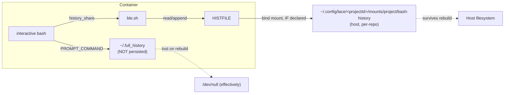

# Persistent, Richer Bash History for Lace Devcontainers

> BLUF: The bash + ble.sh restoration ([nushell-unwind](../proposals/2026-08-25-nushell-unwind.md)) already ships a working persistence primitive: a per-project bind mount (`${lace.mount(project/bash-history)}` → `/commandhistory`) plus ble.sh's `history_share=1`.
> That primitive is under-used: only the `lace` repo itself declares the mount today, `clauthier`'s Dockerfile prepares `/commandhistory` but nothing wires it to a host path so its history does not actually survive a rebuild, and `weftwise` bypasses the mechanism with a single global path shared across every worktree of that repo.
> "Stinkpot" is real: an ~400-line Go, SQLite-backed bash/fish history searcher ("a much tinier atuin") with no sync, no AI, no per-project concept of its own — it would need the exact same lace mount plumbing atuin does.
> Recommendation: fix the mount-wiring gap first (near-zero cost, fixes the stated requirement outright), then layer richness via **atuin in local-only mode** pointed at the per-project mount if project/exit-code/duration/host-scoped search is wanted; keep ble.sh's `history_share` and the existing `~/.full_history` hook regardless, and treat stinkpot/mcfly/hstr as documented-but-not-chosen alternatives.

## Context / Background

The [nushell-unwind proposal](../proposals/2026-08-25-nushell-unwind.md) and its [devlog](../devlogs/2026-08-25-nushell-unwind.md) restored bash + ble.sh as the default shell on the host and in every lace devcontainer (2026-08-25, status `implemented`).
As part of that work, Phase 3 restored a `/commandhistory` bind-mount pattern in `clauthier`'s Dockerfile (mirrored from [Anthropic's claude-code devcontainer Dockerfile](https://github.com/anthropics/claude-code/blob/main/.devcontainer/Dockerfile)) and pointed `HISTFILE` at it, and the devlog's finalization section lists "stinkpot integration" as an explicit, deferred follow-up: "https://tangled.org/oppi.li/stinkpot ... deferred to a separate `/rfp`".
This report is the survey that follow-up asked for: it does not re-propose the shell migration (done) and does not write an implementation plan (a separate downstream step); it surveys the realistic options for **persistent, richer** bash history and recommends a ranking, with the persistent-but-not-shared-across-containers requirement as the central constraint.

## Current State

### The mount primitive already exists, and is inconsistently used

Lace resolves `customizations.lace.mounts.<label>` declarations into a bind mount whose default host path is:

```
~/.config/lace/<projectId>/mounts/project/<label>
```

(`packages/lace/src/lib/mount-resolver.ts:304-312`, `resolveSource`/`resolveFullSpec`), where `projectId` is derived from the **bare-repo root's basename** (`packages/lace/src/lib/project-name.ts:18-19`), not the per-worktree path.
`autoInjectMountTemplates` (`packages/lace/src/lib/template-resolver.ts:521-549`) turns a bare `customizations.lace.mounts.bash-history: { target: "/commandhistory" }` declaration into a `${lace.mount(project/bash-history)}` entry in the generated `mounts[]` array at `lace up` time.

This gives, for free, exactly the isolation shape the task asks for: **one bind-mounted history file per repo, on the host filesystem, distinct from every other project's**, durable across container rebuilds because it lives outside the container image entirely.
It is a bind mount (not a named Docker volume), so it inherits normal host backup/snapshot behavior with no extra tooling.

Three caveats on that primitive as it stands today:

1. **Per-repo, not per-worktree/branch.** All worktrees of the same bare repo (e.g. `lace/main`, `lace/feature-x`) share one `projectId` and therefore one history file. This is arguably correct (it is still "my project," and cross-worktree recall is often desirable), but it means switching branches within a repo does not partition history further. Flag this as a design choice to confirm, not a bug.
2. **Only `lace` (dogfooding itself) declares the mount.** `jif` and `whelm` declare no bash-history mount at all. `clauthier`'s `.devcontainer/devcontainer.json` also declares none today: its Dockerfile creates `/commandhistory`, touches `.bash_history` inside the image, and sets `HISTFILE` to it (`.devcontainer/Dockerfile:40-42,60`), but with no matching `customizations.lace.mounts.bash-history` (or any `mounts[]` entry naming `/commandhistory`), that directory is plain container-image state: **it does not survive a rebuild today**, despite the devlog's claim of "container history persistence via `/commandhistory`." This is a live gap, not a hypothetical one, and closing it is nearly free (one JSON stanza, matching `lace`'s own devcontainer.json).
3. **`weftwise` bypasses the mechanism with a global path.** Its `mounts[]` hardcodes `source=${localEnv:HOME}/code/dev_records/weft/bash/history,target=/commandhistory,type=bind` — a single fixed host path with no project keying at all. Every worktree of `weftwise`, and only `weftwise`, shares this one file; it happens to be per-project by accident of the path choice but is invisible to and inconsistent with the `lace.mount()` convention every other project should be using.

### What's already running inside a container today

- **Plain bash `HISTFILE`.** `dot_config/bash/prompt_and_history.sh:10-12` points `HISTFILE` at `/commandhistory/.bash_history` when the directory exists (host shells are unaffected). `HISTSIZE`/`HISTFILESIZE` are set to 1,000,000; `HISTIGNORE` filters trivial commands (`ls`, `pwd`, `exit`, ...); `histappend` is set (`dot_bashrc:59`). `HISTCONTROL` is present but **commented out** (`prompt_and_history.sh:1`), so consecutive duplicate commands are not deduped. `HISTTIMEFORMAT` is unset, so the history file carries no per-entry timestamps.
- **ble.sh's `history_share=1`** (`dot_blerc:1`) makes every interactive pane in a session re-read/re-append `HISTFILE` in near-real-time, so history is shared live across panes/tabs within one container the way fish's history behaves — without this, cross-pane history only merges on clean shell exit.
- **A hand-rolled rich-history hook** (`prompt_and_history.sh:100-106`, `_prompt_func`) appends `date hostname PWD $(history 1)` to `~/.full_history` on every prompt. This is genuinely richer than plain `HISTFILE` (adds host + cwd), but it is **not routed through the `/commandhistory` mount**: it always writes to `~/.full_history` under `$HOME`, which is not bind-mounted in any project's devcontainer, so this data is lost on every container rebuild. It is also append-only forever, with no dedup, no search UI, and no exit-code/duration capture.
- **A near-identical hook existed in the nushell era and was explicitly rejected as redundant** once nushell's built-in SQLite history (timestamp, hostname, CWD, exit code, duration, session ID) subsumed it ([2026-02-13-nushell-enrichment.md](../proposals/2026-02-13-nushell-enrichment.md), NOTE at line 24; [config review](../reviews/2026-02-13-nushell-config-review.md) lines 86-102). Plain bash has no equivalent built-in, so the same argument does not carry over: under bash, a hand-rolled hook (or a real tool) is the only way to get exit codes/duration/host/cwd on each entry.



## Options Evaluated

### 1. Plain bash `HISTFILE` on the mounted volume (status quo), tuned

The floor. Already wired for persistence (mount-declaration caveats above aside) and already isolated per project by the lace mount mechanism when actually declared.

Cheap tuning available and not yet applied:
- `HISTCONTROL=ignoreboth:erasedups` (currently commented out): dedup consecutive and repeated commands, cutting noise in `history`/`Ctrl-R` search.
- `HISTTIMEFORMAT='%F %T '`: makes bash write `#<unix-epoch>` comment lines into `HISTFILE` on every `history -a`/exit, so entries carry a timestamp without any external tool.
- Explicit `history -a` in `PROMPT_COMMAND` (belt-and-suspenders with ble.sh's `history_share`, and the only thing standing between "recorded" and "lost" if ble.sh ever fails to load, since a devcontainer stop/kill does not guarantee a clean bash exit that flushes history otherwise).

Ceiling: plain text, no exit codes, no per-directory/host filtering, no structured search beyond `Ctrl-R`/`grep`. This is "richer than nothing," not "rich."

### 2. ble.sh's own history features

ble.sh does not replace `HISTFILE`; it wraps it. Its value-add is `bleopt history_share=1` (already on) for live cross-pane sharing, plus its own incremental history search widgets (`isearch/backward` bound to `C-r` in vi-normal mode, `dot_blerc:34`) and ghost-text autosuggestion drawn from history. It respects `HISTCONTROL`/`HISTIGNORE` since it operates on the same `HISTFILE`. It adds no metadata (no timestamps beyond what `HISTTIMEFORMAT` already gives, no exit codes, no cwd). Best understood as free UX polish on top of option 1, not a competing option — keep it regardless of what else is chosen.

### 3. atuin

SQLite-backed, records command text + timestamp + exit code + duration + hostname + session ID + cwd automatically, ships a `Ctrl-R` TUI with filters to scope search to directory/host/session/global.
Runs fully **offline**: sync is opt-in (skip login, no server config) and, if ever wanted, self-hostable so history never has to leave the user's infrastructure.
Storage location is overridable per-invocation via `ATUIN_DB_PATH` (materialized history db) and `ATUIN_CONFIG_DIR` (config.toml location) [environment-variable reference](https://docs.atuin.sh/configuration/config/) — meaning it can be pointed at a path under the existing per-project `/commandhistory` mount (e.g. `/commandhistory/atuin/history.db`) and inherit the same per-repo isolation the plain-`HISTFILE` mechanism already has, with zero new lace plumbing.
Cost: a real daemon-adjacent binary and shell-init hook to install per-container (a devcontainer feature, mirroring the `blesh` feature's pinned-release-tarball pattern), a SQLite file per project instead of a flat text file, and it takes over `Ctrl-R` (needs a ble.sh keybinding coexistence check, since ble.sh also binds `C-r`).

> NOTE: This repo's 2026-02-13 nushell-enrichment work evaluated and **rejected** atuin — but only because nushell's built-in SQLite history already provided the same fields atuin adds, making atuin redundant there. Bash has no such built-in, so that rejection does not transfer; the rationale for bash is closer to "atuin vs. a hand-rolled hook," where atuin wins on richness and search UX out of the box.

### 4. mcfly

Rust, SQLite-backed, replaces `Ctrl-R` with a "neural network"-ranked search that weights recent directory/command context. Also tracks exit status, timestamp, execution directory; keeps writing the normal `HISTFILE` alongside its own db so it degrades gracefully if disabled.
As of this report, the [Gentoo package](https://packages.gentoo.org/packages/app-shells/mcfly) lists it as needing a new maintainer — a real maintenance-risk signal for a tool this repo would depend on long-term.
No native per-directory/per-project store; would need the same manual `MCFLY_HISTFILE`/db-path env-var redirection into the mount as atuin, with less documentation of that pattern than atuin has.

### 5. hstr

Older, simpler ncurses `Ctrl-R` replacement operating directly on the existing plain-text `HISTFILE` (adds ranking/frecency and a fuzzy filter UI, no separate database, no exit codes/timestamps/cwd). Lowest richness ceiling of the group; lowest integration cost (no new storage format, so the existing per-project bind mount covers it with zero changes). Useful as a fallback if a heavier tool is undesired, not as the "richer" answer being sought here.

### 6. "stinkpot"

Confirmed real: [`oppi.li/stinkpot` on Tangled](https://tangled.org/oppi.li/stinkpot), also covered on [Lobsters](https://lobste.rs/s/bvgaff/stinkpot_sqlite_backed_shell_history) and [Hacker News](https://news.ycombinator.com/item?id=49034777).
Not a weft/lace-internal tool; no reference to it exists anywhere in the `lace` repo (`grep -rn stinkpot` over `/var/home/mjr/code/weft/lace/main` returns nothing).
It is exactly what its creator calls it: **"a much tinier atuin"** — a ~400-line Go, SQLite-backed history searcher for bash and fish, deliberately stripped of atuin's sync server, AI features, dotfiles manager, script manager, and KV store. Storage defaults to `~/.local/share/stinkpot`; init is a shell-eval line, same shape as atuin/starship/zoxide. Ships an optional Home Manager (Nix) module.
It has **no documented per-project isolation, no per-directory search filters, and no sync** — it is intentionally the minimal core of atuin's local-history use case, nothing more.
Given no lace-specific integration exists and its isolation story is identical to atuin's (an overridable local db path, needing the same manual mount-pointing this report recommends for atuin), stinkpot is best read as **"atuin, but smaller and newer,"** not a categorically different option. Its appeal is likely supply-chain/footprint (400 lines vs. atuin's much larger Rust codebase) and avoiding features that will never be used (sync, AI). That is a legitimate reason to prefer it if minimalism is valued over atuin's larger, more battle-tested ecosystem and richer directory/host/session filter UI — the trade is polish and adoption maturity for size.

## Comparison Table

| Option | Durability across rebuilds | Per-project isolation | Richness (dedup/timestamps/search/context/exit-code) | ble.sh integration | Devcontainer ergonomics | Maintenance cost |
|---|---|---|---|---|---|---|
| Plain `HISTFILE` (status quo, untuned) | Yes, if mount declared (currently only `lace`) | Yes, via existing `lace.mount()` mechanism | Low: text file, no exit code/duration/host without manual tuning | Native (ble reads/writes `HISTFILE` directly) | Zero: no new tooling | ~None |
| Plain `HISTFILE`, tuned (`HISTCONTROL`, `HISTTIMEFORMAT`, explicit flush) | Same as above | Same as above | Low-medium: dedup + timestamps, still text/`grep`-only search | Native | Zero: config-only change | ~None |
| ble.sh history features (`history_share`, isearch) | N/A (layered on `HISTFILE`) | N/A | Adds live cross-pane sharing + incremental search UX, no new metadata | Is ble.sh | Zero, already on | ~None |
| atuin (local-only) | Yes, once `ATUIN_DB_PATH` points into the mount | Yes, via `ATUIN_DB_PATH`/`ATUIN_CONFIG_DIR` pointed at the mount | High: exit code, duration, host, cwd, session, dir/host/session filters, TUI search | Needs `Ctrl-R` coexistence check with ble | Needs a devcontainer feature (installer + shell-init), one-time build | Low-medium: active, popular project |
| mcfly | Yes, with manual db-path redirection | Manual, same pattern as atuin but less documented | High: exit code, timestamp, dir-context ranking | Also binds `Ctrl-R`, same coexistence concern | Needs a devcontainer feature | Medium-high: flagged as needing a new maintainer |
| hstr | Yes, operates on existing `HISTFILE` | Free, rides the existing mount | Low: ranking/fuzzy filter only, no new metadata | No conflict (doesn't need to own `Ctrl-R`, can bind elsewhere) | Needs a devcontainer feature, but trivial (no db) | Low: simple, stable, unglamorous |
| stinkpot | Yes, with manual db-path redirection (same shape as atuin) | Manual, no built-in concept, same pattern needed | Medium-high: exit-agnostic (unclear if it captures exit code; primarily search/frequency/timestamp per its README) | Unverified; likely needs `Ctrl-R` coexistence check like atuin | Needs a devcontainer feature; no prior art in this repo's tooling | Higher: new/small project, unclear long-term maintenance signal, no existing devcontainer-feature precedent to copy |

## Recommendation Ranking

1. **Fix the mount-wiring gap first, independent of tool choice.** Add `customizations.lace.mounts.bash-history` (target `/commandhistory`) to `clauthier`'s `devcontainer.json` to match `lace`'s own dogfooded pattern, and do the same for `jif`/`whelm` if history persistence is wanted there. Migrate `weftwise` off its hardcoded global path onto the same `lace.mount()` declaration so it gets real per-project isolation instead of an accidental one-off path. This alone delivers "persistent and not shared across projects" for whatever history format sits on top of it, and it is nearly free.
2. **Keep the status quo tuned, always.** Uncomment/set `HISTCONTROL=ignoreboth:erasedups`, set `HISTTIMEFORMAT`, and add an explicit `history -a` flush to `PROMPT_COMMAND` as a non-ble.sh-dependent safety net. Keep `bleopt history_share=1`. This costs minutes and raises the floor regardless of any richer tool decision.
3. **Add atuin in local-only mode as the "richer" layer, if the richer search UX is actually wanted**, pointed at a path under the per-project `/commandhistory` mount via `ATUIN_DB_PATH`. It is the best-documented, most actively maintained option with the isolation story this task requires, and its local-only mode sidesteps every objection the earlier nushell-era rejection raised (that rejection was about redundancy with nu's built-in SQLite history, which does not apply to bash). Resolve the `Ctrl-R` binding conflict with ble.sh before adopting.
4. **Consider stinkpot only if minimal footprint is a stated priority over atuin's maturity.** It is real, it does what it claims, but it brings no isolation story or devcontainer precedent beyond what atuin already needs to be given manually, and it is a much younger/smaller project. Not a categorical upgrade over atuin for this use case; a legitimate alternative if the 400-line-Go-vs-larger-Rust-codebase trade matters more than polish.
5. **hstr as a low-risk fallback**, not a first choice: it adds fuzzy search UX with zero new persistence/isolation surface (rides the existing `HISTFILE` mount), useful if a richer tool is deemed not worth the container-feature maintenance cost at all.
6. **mcfly: do not adopt.** The maintainer-needed signal is a real risk for a tool this repo would come to depend on for daily history search, and it offers nothing atuin doesn't already do better here.

## Open Questions / Follow-ups

- Should per-worktree history isolation (not just per-repo) be a goal? The current `lace.mount()` keying is per bare-repo root; splitting further would be a `lace` change, not a dotfiles change, and is out of scope here.
- If atuin is adopted, decide the `Ctrl-R` ownership question explicitly (atuin's binding vs. ble.sh's `isearch/backward`) before writing the implementation proposal.
- The `~/.full_history` hook's richer fields (host, cwd) are currently lost on every container rebuild since it writes outside the mount; either route it into `/commandhistory` or fold its intent into whichever richer tool is chosen, rather than maintaining two overlapping rich-history mechanisms.
- Whether to standardize the `blesh`-feature pattern (pinned-release-tarball devcontainer feature, mirrored fully in `/var/home/mjr/code/weft/lace/main/devcontainers/features/src/blesh/`) for an atuin or stinkpot feature is an implementation-proposal decision, not this report's.

This report intentionally stops at recommendation; the implementation plan (devcontainer feature, mount declarations per repo, config wiring) is a separate downstream `/propose`.
